.. module:: hasasia

.. note:: This tutorial was generated from a Jupyter notebook that can be
          downloaded `here <_static/notebooks/full_pipeline_tutorial.ipynb>`_.

.. _full_pipeline_tutorial:

PsrSigSim Example Notebook
==========================

The purpose of this notebook is to serve as an example notebook to show
how the Pulsar Signal Simulator (PsrSigSim) works as well as show off
its different capabilities. Full development of the PsrSigSim is ongoing
and thus this notebook may change and evolve and should be expected to.

We start by importing all the necessary packages needed to run this
notebook, in addition to just the PsrSigSim

.. code:: python

    from datetime import datetime
    startTime = datetime.now()

.. code:: python

    # These are all standard packages
    import numpy as np
    import scipy as sp
    import matplotlib.pyplot as plt
    import os
    import sys
    from scipy import stats
    from astropy import units as u
    from astropy import table
    import subprocess
    # These are more specialized pulsar packages, necessary for this notebook
    import pdat
    import pypulse as pp # not required for psrsigsim
    # import pint packages
    import pint
    import pint.models as models
    import pint.toa as toa
    import pint.residuals as r
    import pint.fitter as fit
    import pint.polycos as polycos
    
    # The pulsar signal simulator imports necessary to run the notebook
    module_path = os.path.abspath(os.path.join('..'))
    if module_path not in sys.path:
        sys.path.append(module_path)
    import psrsigsim as pss
    from psrsigsim.utils import make_quant
    # Some extra magic lines to make things run nicely :)
    %matplotlib inline
    
    %load_ext autoreload
    %autoreload 2

.. parsed-literal::

    The autoreload extension is already loaded. To reload it, use:
      %reload_ext autoreload

We now will define some convience functions for use later

.. code:: python

    # Define a function for easier plotting later on/throughout the testing
    def plotsignal(signals, nbins=2048):
        # signals can be a list of multiple signals to overplot
        for ii in range(len(signals)):
            # Define the x axis
            phases = np.linspace(0.0, len(signals[ii]), len(signals[ii]))/nbins
            # now plot it
            plt.plot(phases, signals[ii], label="signal %s" % (ii))
        plt.xlim([0.0, np.max(phases)])
        plt.xlabel("Pulse Phase")
        plt.ylabel("Arb. Flux")
        plt.show()
        plt.close()

.. code:: python

    # Functions that can be used in-notebook to run command-line commands, not strictly necessary for the PsrSigSim
    def call(x):
        subprocess.call(x,shell=True)
        
    def callvar(x):
        variable = subprocess.check_output(x, shell=True)
        return variable

Simulating a Signal
-------------------

Here we will go over how to simulate a signal and what the required
parameters are. Currently only filterbank-style signals can be
simulated. However there are two modes, a 'FOLD' mode which produces
coherently folded filterbank data in subintegrations that can be saved
to a PSRFITS file, and a 'SEARCH' mode that produces single pulses.
Currenly 'SEARCH' or single-pulse simulated data cannot be saved to a
PSRFITS files with the PsrSigSim.

Here we will sgo through an example of simulating a ``fold`` mode style
observation of the millisecond pulsar PSR B1855+09 at 1400 MHz as
observed with the Arecibo Telescope. Our pulse profile templates, timing
model parameters, and observation parameters come from the NANOGrav
11-yr dataset.

We require a few different parameters right off the bat to simulate our
signal, so we will first define those parameters, and then initialize
our filterbank signal object.

.. code:: python

    # define the required filterbank signal parameters
    f0 = 1380 # center observing frequecy in MHz
    bw = 800.0 # observation MHz
    Nf = 512 # number of frequency channels
    F0 = np.double(186.4940812499314404) # pulsar frequency in Hz
    f_samp = F0*2048*10**-6 # sample rate of data in MHz, here 2048 bins across the pulse
    subintlen = 84.64126/64.0 # desired length of fold-mode subintegration in seconds
    # Now we define our signal
    signal_Lband = pss.signal.FilterBankSignal(fcent = f0, bandwidth = bw, Nsubband=Nf,\
                                              sample_rate=f_samp, fold=True, sublen=subintlen)

.. parsed-literal::

    Warning: specified sample rate 0.3819398783998596 MHz < Nyquist frequency 1600.0 MHz

Now before we define our pulsar, we need to define the pulse profile
shape of the pulsar. This can be done by defining an arbitrary number of
Gaussian components, supplying some functional form of the pulse
profile, or inputing a data array that defines the pulse profile shape.

Here we will use the ``pypulse`` python package to read the NANOGrav
11-yr 1400 MHz profile PSRFITS file for PSR 1855+09 as a data array, and
then input that array as the pulse profile.

.. code:: python

    # Load the templates
    template_Lband = "template_files/profiles/L-band/B1855+09.L-wide.PUPPI.11y.x.sum.sm"
    temp_Lband = pp.archive.Archive(template_Lband, lowmem=True)
    temp_Lband_ar = temp_Lband.getData()
    # And then plot the profile
    plt.plot(np.linspace(0.0,1.0,len(temp_Lband_ar)), temp_Lband_ar, c = 'k')
    plt.ylabel("Arb. Flux")
    plt.xlabel("Pulse Phase")
    plt.show()
    plt.close()

.. parsed-literal::

    Loading: template_files/profiles/L-band/B1855+09.L-wide.PUPPI.11y.x.sum.sm
    Load time: 0.17 s

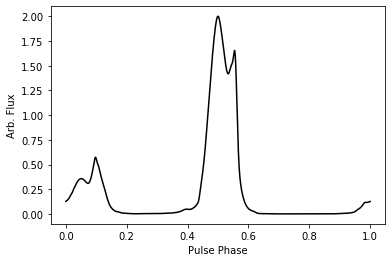

.. code:: python

    # Now we will take the data array and load it into a profile class object
    # Define the profile, and the phase bins corresponding to each point in the data array
    prof_Lband = pss.pulsar.DataProfile(temp_Lband_ar,\
                                        phases = None,\
                                       Nchan=signal_Lband.Nchan)

Now we will use this profile and define our pulsar object. In addition
to the pulse profile, we also need to tell the simulator what the
pulsars period is (in seconds), its mean flux (in Jy), and the pulsar's
name.

.. code:: python

    # Define the necessary parameters
    period = np.double(1.0)/F0 # seconds
    flux = 0.004 # Jy, from Demorest et al. 2013
    psr_name = "B1855+09"
    # Define the pulsar object
    pulsar = pss.pulsar.Pulsar(period=period, Smean=flux, profiles=prof_Lband, name=psr_name)

Now we need to tell the pulsar to use the parameters from the signal
class, along with what we would like the full length of the observation
to be, to actually make the pulses. Here we are will use the ``fold``
mode signal defined above, and an observation length such that we will
generate 64 subintegrations, the same number as in a standard output
file from and NANOGrav 1400 MHz Arecibo observation.

.. code:: python

    # Define the observation time, in seconds
    ObsTime = 84.64126 # seconds
    # make the pulses
    pulsar.make_pulses(signal_Lband, tobs = ObsTime)

Now we will use our convenience function above to plot the signal that
we have simulated. We will plot the full signal as well as just a
subsection to better show what it will look like.

.. code:: python

    # We plot just the first frequency channel, but all pulses simulated
    plotsignal([signal_Lband.data[0,:]])
    # Now we plot just the first two pulses simulated, also from the first frequency channel
    plotsignal([signal_Lband.data[0,:4096]])

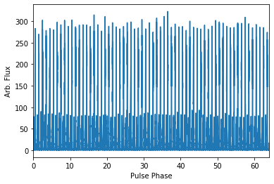

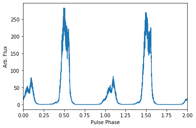

Now that we have generated some initial pulses and data, we can add a
few extra effects. Currently, we can disperse our pulses, add scattering
delays, and also add different frequency dependent shifts based on FD
(or frequency dependent) parameters as defined in Arzourmanian et al.
2016. These FD parameters are polynomial coefficients that account for
different frequency dependent effects, such as pulse profile evolution
in frequency.

For the purpose of this example, we will just disperse our pulses using
the known DM (or dispersion measure) for PSR B1855+09. To do this, we
will first instantiate our ISM class, and then use the build in function
to disperse the data.

.. code:: python

    # First define the dispersion measure
    dm = 13.299393 # pc cm^-3
    # Now define the ISM class
    ism_ob = pss.ism.ISM()
    # Now we give the ISM class the signal and disperse the data
    ism_ob.disperse(signal_Lband, dm)
    # If we plot the same pulses as above, you can see that the phase of the pulse has 
    # been shfited due to the dispersion
    plotsignal([signal_Lband.data[0,:4096]])

.. parsed-literal::

    98% dispersed in 3.844 seconds.

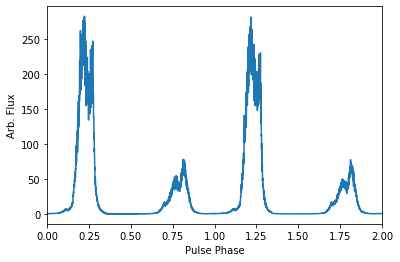

Now we need to tell the simulator what telescope we want to use to
observe, and what reciever and backend we want to simulate. This is
important because the telescope and reciever parameters will determine
how much radiometer noise is added to our signal. Currently the
simulator has a few Arecibo and Green Bank Telescope system pre-defined.
We will use the Arecibo 1400 MHz telescope and receiver already defined
in the simulator. However, a person can also define a telescope,
reciever, and backend system for any telescope you like.

To do this we instantiate our telescope class, and then generate the
radiometer noise and add it to the dispersed pulsar signal by the
``observe`` function in the telescope class.

.. code:: python

    # Define the telescope class
    tscope = pss.telescope.telescope.Arecibo()
    # Now we observe with the telescope; noise=True adds the radiometer noise to thes ignal
    output = tscope.observe(signal_Lband, pulsar, system="Lband_PUPPI", noise=True)
    # Now plot the signal as above but with the added radiometer noise
    plotsignal([signal_Lband.data[0,:4096]])

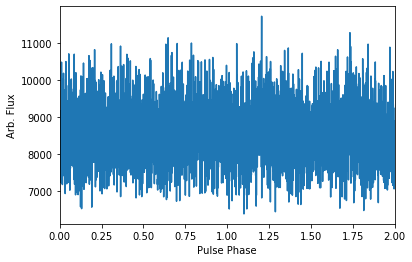

You will notice that with the current set up in our example simulation
the radiometer noise is much stronger than the pulsar signal. This is to
be expected given our particular set up, however if we were to fold this
simulated data more, we would be able to see the pulse signal start to
stand out above the noise. Depending on the set up you want for your
simulations, the radiometer noise and puslar signal strength will be
scaled appropriately.

Now, all of this data exists as python data arrays. If you have pulsar
software that can analyze data as python arrays, then you can save this
data in your favorite format (we recommend hdf5 format) and preform
whatever your desired analysis is. However, much existing pulsar data
analysis software works directly on PSRFITS files. We currently do not
generate a PSRFITS file from scratch (although that feature will come in
a future version), but we do use the ``pdat`` or pulsar data toolbox
python package to take an existing PSRFITS file and overwrite the data
in and some header information and metadata to save our simulated data
to a PSRFITS file that can be analyzed with the well used ``PSRCHIVE``
software.

To do this we need to define a couple of variables. First, we need to
have a template PSRFITS file. We also need to have a name for the output
PSRFITS file. In addition, we will also need a pulsar par file that
contains all the timing parameters that have been simulated here, in
order to make sure once the data is saved, if it is manipulated or
folded, it is folded correctly.

.. code:: python

    # We start by defining these files mentioned above
    tempfits = "template_files/puppi_57627_B1855+09_1077_0001.fits" # template PSRFITS file
    parfile = "par_files/B1855+09_NANOGrav_11yv0_example.par"
    outfits = "test_fits.fits" # name of our output fits file

.. code:: python

    # Now we load our template fits file into the simulator psrfits class
    pfit = pss.io.PSRFITS(path=outfits, template=tempfits, fits_mode='copy', obs_mode='PSR')
    # We use a build in function to get the signal class parameters needed to write header data
    pfit._get_signal_params(signal = signal_Lband) 
    """
    Now we save the data. Much of the inputs here are used to generate polycos to write to 
    the PSRFITS file so that the data can be folded correctly. `phaseconnect` may be set to 
    `False` in which case all following inputs are not required, however the saved data may 
    not appropriately phase connect the pulses and it may not be suitable for pulsar timing
    experiments.
    
    NOTE: Currently the `PINT` python package is required to generate the polycos and is needed
    for the phase connection. 
    """
    pfit.save(signal_Lband, pulsar, phaseconnect = True, parfile = parfile, \
              MJD_start = 55999.9861, segLength = 60.0,\
              inc_len = 0.0, ref_MJD = 56000.0, usePint = True)

.. parsed-literal::

    (64, 4, 512, 2048)
    INFO: No pulse numbers found in the TOAs [pint.toa]
    INFO: Applying clock corrections (include_GPS = True, include_BIPM = True. [pint.toa]
    INFO: Special observatory location. No clock corrections applied. [pint.observatory.special_locations]
    INFO: Computing TDB columns. [pint.toa]
    INFO: Computing positions and velocities of observatories and Earth (planets = False), using DE421 ephemeris [pint.toa]
    INFO: No pulse numbers found in the TOAs [pint.toa]
    INFO: Applying clock corrections (include_GPS = True, include_BIPM = True. [pint.toa]
    INFO: Special observatory location. No clock corrections applied. [pint.observatory.special_locations]
    INFO: Computing TDB columns. [pint.toa]
    INFO: Computing positions and velocities of observatories and Earth (planets = False), using DE421 ephemeris [pint.toa]
    INFO: No pulse numbers found in the TOAs [pint.toa]
    INFO: Applying clock corrections (include_GPS = True, include_BIPM = True. [pint.toa]
    INFO: Special observatory location. No clock corrections applied. [pint.observatory.special_locations]
    INFO: Computing TDB columns. [pint.toa]
    INFO: Computing positions and velocities of observatories and Earth (planets = False), using DE421 ephemeris [pint.toa]

.. parsed-literal::

    WARNING: No ephemeris provided to TOAs object or compute_TDBs. Using DE421 [pint.toa]
    WARNING: No ephemeris provided to TOAs object or compute_TDBs. Using DE421 [pint.toa]
    WARNING: No ephemeris provided to TOAs object or compute_TDBs. Using DE421 [pint.toa]

.. parsed-literal::

    
    Finished writing and saving the file

We have now saved our data to a PSRFITS file called ``test_fits.fits``.
This file can be folded and processed with ``PSRCHIVE`` for any number
of projects you may think of. We will show an example below where we
simulate four different NANOGrav-style observations of B1855+09 at two
different MJDs and two different frequencies, get TOAs from PSRCHIVE,
and then get timing residuals with the ``PINT`` python package.

Simulating a Single-Pulse Signal
--------------------------------

Here we will show an example of generating a single-pulse filterbank
signal. The inputs are much the same as above, however the capability to
save this single-pulse data to a ``SEARCH`` mode PSRFITS file has not
yet been added to the PsrSigSim. The procedure for generating
single-pulse data follows much in the way that folded data does however.

We note that the same variables required to make a ``fold`` mode signal
(e.g. observing frequency, bandwidth, period, etc.) are also required,
however as we have defined these values above we do not redefine them
here.

.. code:: python

    # All values needed to define the signal are defined above
    # The only change here is to set fold=False (no input is given for sublen field)
    signal_Lband_sp = pss.signal.FilterBankSignal(fcent = f0, bandwidth = bw, Nsubband=Nf,\
                                              sample_rate=f_samp, fold=False)

.. parsed-literal::

    Warning: specified sample rate 0.3819398783998596 MHz < Nyquist frequency 1600.0 MHz

And that's the only major change. We note that single pulse data will
take up a *much* larger amount of space than folded data, so we will set
our observation length here to be just 3 pulse periods, however all
other parts remain the same

.. code:: python

    # We define the pulsar; NOTE - pulse profile object was defined above
    pulsar_sp = pss.pulsar.Pulsar(period=period, Smean=flux, profiles=prof_Lband, name=psr_name)
    # Now we set the observation time
    ObsTime_sp = 3*period # seconds
    # make the pulses
    pulsar_sp.make_pulses(signal_Lband_sp, tobs = ObsTime_sp)
    # We plot just the first frequency channel, but all pulses simulated
    plotsignal([signal_Lband_sp.data[0,:]])

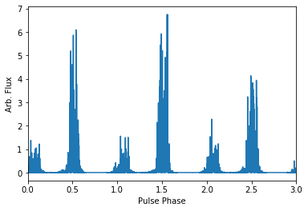

Now we run the rest of the simulation exactly as above, with some plots

.. code:: python

    ism_ob = pss.ism.ISM()
    # Now we give the ISM class the signal and disperse the data
    ism_ob.disperse(signal_Lband_sp, dm)
    # If we plot the same pulses as above, you can see that the phase of the pulse has 
    # been shfited due to the dispersion
    plotsignal([signal_Lband_sp.data[0,:]])

.. parsed-literal::

    98% dispersed in 0.276 seconds.

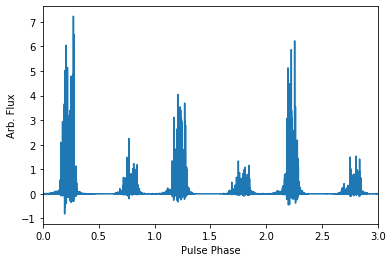

.. code:: python

    # Define the telescope class
    tscope = pss.telescope.telescope.Arecibo()
    # Now we observe with the telescope; noise=True adds the radiometer noise to thes ignal
    output = tscope.observe(signal_Lband_sp, pulsar, system="Lband_PUPPI", noise=True)
    # Now plot the signal as above but with the added radiometer noise
    plotsignal([signal_Lband_sp.data[0,:4096]])

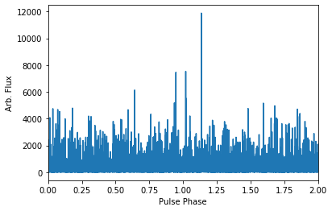

and that's all there is to it to simulate single-pulse filterbank data.
In a future version of the simulator we will be able to save this single
pulse data to PSRFITS files as well.

Simulating a Dataset
--------------------

Here we will use the same methods as used to generate a single simulated
``fold`` mode observation of PSR B1855+09 and save it as a PSRFITS file,
and generate a few obseravations at different MJDs and different
observing frequencies. We will again use NANOGrav 11-yr pulse profile
templates and the standard NANOGrav observing parameters to generate the
dataset.

We note that the 1400 MHz simulated observation will be a factor of
about 15 shorter than is standard for space and time purposes with this
example notebook. We also note that the simulations made here are
extrememly simplistic; they assume that the simulated data is
barycentered and the only additional delay is the dispersion delay.
There is not solar system delay, pulse period spin down, etc. (though we
plan to include that in a future version).

We offer some functions to get TOAs and timing residuals with PINT from
this simulated dataset given these simplified models below as well.

.. code:: python

    # We define all variables needed for the simulation at the begining.
    dm = 13.299393 # pc cm^-3
    F0 = np.double(186.4940812499314404) # pulsar frequency, Hz
    period = np.double(1.0)/F0 # pulsar period, seconds
    bw = 800.0 # bandwidth, MHz
    Nf = 512 # number of frequency channels
    f0 = 1380 # central observing frequency, MHz
    ObsTime = 84.64126 # total observing time, seconds
    telescope = "Arecibo" # Telescope name (for default telescopes)
    psr_name = "B1855+09" # pulsar name
    flux = 0.004 # mean flux, Jy (from Demorest et al. 2013)
    f_samp = F0*2048*10**-6 # sampling rate, chosen to be 2048 bins per profile
    subintlen = 84.64126/64.0 # length of subintegration, seconds

.. code:: python

    # Now we load two different pulse profile templates with pypulse
    # both are from the NANOGrav 11-yr data release; start with 1400 MHz profile
    template_Lband = "template_files/profiles/L-band/B1855+09.L-wide.PUPPI.11y.x.sum.sm"
    temp_Lband = pp.archive.Archive(template_Lband, lowmem=True)
    temp_Lband_ar = temp_Lband.getData()
    # Plot the profile
    plt.plot(temp_Lband_ar)
    plt.ylabel("Arb. Flux")
    plt.xlabel("Pulse Phase")
    plt.show()
    plt.close()
    # and the 430 MHz
    template_430 = "template_files/profiles/430_MHz/B1855+09.430.PUPPI.11y.x.sum.sm"
    temp_430 = pp.archive.Archive(template_430, lowmem=True)
    temp_430_ar = temp_430.getData()
    # Plot the profile
    plt.plot(temp_430_ar)
    plt.ylabel("Arb. Flux")
    plt.xlabel("Pulse Phase")
    plt.show()
    plt.close()

.. parsed-literal::

    Loading: template_files/profiles/L-band/B1855+09.L-wide.PUPPI.11y.x.sum.sm
    Load time: 0.21 s

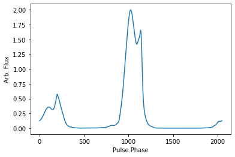

.. parsed-literal::

    Loading: template_files/profiles/430_MHz/B1855+09.430.PUPPI.11y.x.sum.sm
    Load time: 0.16 s

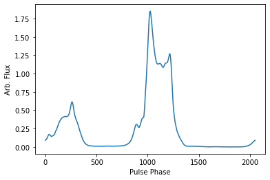

Now we will loop through the different simulate steps as described
above. The looping will allow us to save the simulated data at different
MJDs but retain a phase connection between the files. We will separate
the data by 30 days, and run the 1400 MHz and 430 MHz observations
separately.

.. code:: python

    # Now lets make the L-band simulated data; We will loop through a few times
    inc_lens = [0.0,30.0]
    tempfits = "template_files/puppi_57627_B1855+09_1077_0001.fits"
    parfile = "par_files/B1855+09_NANOGrav_11yv0_example.par"
    
    # Now loop through
    for ii in range(len(inc_lens)):
        #start by defining the signal
        signal_Lband = pss.signal.FilterBankSignal(fcent = f0, bandwidth = bw, Nsubband=Nf,\
                                              sample_rate=f_samp, fold=True, sublen=subintlen)
        # Define the profile
        prof_Lband = pss.pulsar.DataProfile(temp_Lband_ar, phases = None, \
                                            Nchan=signal_Lband.Nchan)
        # Define the pulsar
        pulsar = pss.pulsar.Pulsar(period=period, Smean=flux, profiles=prof_Lband, \
                                   name=psr_name)
        # make the pulses
        pulsar.make_pulses(signal_Lband, tobs = ObsTime)
        # Define ISM and disperse the data
        ism_ob = pss.ism.ISM()
        ism_ob.disperse(signal_Lband, dm)
        # Define telescope and add radiometer noise
        tscope = pss.telescope.telescope.Arecibo()
        out_array = tscope.observe(signal_Lband, pulsar, system="Lband_PUPPI", noise=True)
        # Get our template PSRFITS file
        fitspath = 'test_fits_Lband'+str(ii+1)+'.fits'
        pfit = pss.io.PSRFITS(path=fitspath, template=tempfits, fits_mode='copy', \
                              obs_mode='PSR')
        pfit._get_signal_params(signal = signal_Lband) 
        # Now save the data
        pfit.save(signal_Lband, pulsar, phaseconnect = True, parfile = parfile, \
                  MJD_start = 55999.9861+inc_lens[ii],segLength = 60.0,\
                  inc_len = inc_lens[ii], ref_MJD = 56000.0, usePint = True)

.. parsed-literal::

    Warning: specified sample rate 0.3819398783998596 MHz < Nyquist frequency 1600.0 MHz
    98% dispersed in 3.795 seconds.(64, 4, 512, 2048)
    INFO: No pulse numbers found in the TOAs [pint.toa]
    INFO: Applying clock corrections (include_GPS = True, include_BIPM = True. [pint.toa]
    INFO: Special observatory location. No clock corrections applied. [pint.observatory.special_locations]
    INFO: Computing TDB columns. [pint.toa]
    INFO: Computing positions and velocities of observatories and Earth (planets = False), using DE421 ephemeris [pint.toa]
    INFO: No pulse numbers found in the TOAs [pint.toa]
    INFO: Applying clock corrections (include_GPS = True, include_BIPM = True. [pint.toa]
    INFO: Special observatory location. No clock corrections applied. [pint.observatory.special_locations]
    INFO: Computing TDB columns. [pint.toa]
    INFO: Computing positions and velocities of observatories and Earth (planets = False), using DE421 ephemeris [pint.toa]
    INFO: No pulse numbers found in the TOAs [pint.toa]
    INFO: Applying clock corrections (include_GPS = True, include_BIPM = True. [pint.toa]
    INFO: Special observatory location. No clock corrections applied. [pint.observatory.special_locations]
    INFO: Computing TDB columns. [pint.toa]
    INFO: Computing positions and velocities of observatories and Earth (planets = False), using DE421 ephemeris [pint.toa]

.. parsed-literal::

    WARNING: No ephemeris provided to TOAs object or compute_TDBs. Using DE421 [pint.toa]
    WARNING: No ephemeris provided to TOAs object or compute_TDBs. Using DE421 [pint.toa]
    WARNING: No ephemeris provided to TOAs object or compute_TDBs. Using DE421 [pint.toa]

.. parsed-literal::

    
    Finished writing and saving the file
    Warning: specified sample rate 0.3819398783998596 MHz < Nyquist frequency 1600.0 MHz
    98% dispersed in 3.862 seconds.(64, 4, 512, 2048)
    INFO: No pulse numbers found in the TOAs [pint.toa]
    INFO: Applying clock corrections (include_GPS = True, include_BIPM = True. [pint.toa]
    INFO: Special observatory location. No clock corrections applied. [pint.observatory.special_locations]
    INFO: Computing TDB columns. [pint.toa]
    INFO: Computing positions and velocities of observatories and Earth (planets = False), using DE421 ephemeris [pint.toa]
    INFO: No pulse numbers found in the TOAs [pint.toa]
    INFO: Applying clock corrections (include_GPS = True, include_BIPM = True. [pint.toa]
    INFO: Special observatory location. No clock corrections applied. [pint.observatory.special_locations]
    INFO: Computing TDB columns. [pint.toa]
    INFO: Computing positions and velocities of observatories and Earth (planets = False), using DE421 ephemeris [pint.toa]
    INFO: No pulse numbers found in the TOAs [pint.toa]
    INFO: Applying clock corrections (include_GPS = True, include_BIPM = True. [pint.toa]
    INFO: Special observatory location. No clock corrections applied. [pint.observatory.special_locations]
    INFO: Computing TDB columns. [pint.toa]
    INFO: Computing positions and velocities of observatories and Earth (planets = False), using DE421 ephemeris [pint.toa]

.. parsed-literal::

    WARNING: No ephemeris provided to TOAs object or compute_TDBs. Using DE421 [pint.toa]
    WARNING: No ephemeris provided to TOAs object or compute_TDBs. Using DE421 [pint.toa]
    WARNING: No ephemeris provided to TOAs object or compute_TDBs. Using DE421 [pint.toa]

.. parsed-literal::

    
    Finished writing and saving the file

.. code:: python

    # Now do the 430 MHz data; redefine some variables for the 430 MHz data
    Nf = 64 # number of frequency channels
    bw = 100.0 # bandwidth, MHz
    f0 = 430 # center observing frequency, MHz
    ObsTime = 1203.8455 # total observation time, seconds
    subintlen =1203.8455/113.0 # subintegration length, seconds
    flux = 0.0246 # mean flux, Jy (from Demorest et al. 2013)
    
    # Now define files and values necessary for the observation.
    inc_lens = [0.1, 30.1] # slightly offset from the 1400 MHz observations
    tempfits = "template_files/puppi_57627_B1855+09_1075_0001.fits"
    parfile = "par_files/B1855+09_NANOGrav_11yv0_example.par"
    
    # Now loop through
    for ii in range(len(inc_lens)):
        #start by defining the signal
        signal_430 = pss.signal.FilterBankSignal(fcent = f0, bandwidth = bw, Nsubband=Nf,\
                                              sample_rate=f_samp, fold=True, sublen=subintlen)
        # Define the profile
        prof_430 = pss.pulsar.DataProfile(temp_430_ar, phases = None, \
                                            Nchan=signal_430.Nchan)
        # Define the pulsar
        pulsar = pss.pulsar.Pulsar(period=period, Smean=flux, profiles=prof_430, name=psr_name)
        # make the pulses
        pulsar.make_pulses(signal_430, tobs = ObsTime)
        # Define ISM and disperse the data
        ism_ob = pss.ism.ISM()
        ism_ob.disperse(signal_430, dm)
        # Define telescope and add radiometer noise
        tscope = pss.telescope.telescope.Arecibo()
        out_array = tscope.observe(signal_430, pulsar, system="430_PUPPI", noise=True)
        # Get our template PSRFITS file
        fitspath = 'test_fits_430'+str(ii+1)+'.fits'
        pfit = pss.io.PSRFITS(path=fitspath, template=tempfits, fits_mode='copy', \
                              obs_mode='PSR')
        pfit._get_signal_params(signal = signal_430) 
        # Now save the data
        pfit.save(signal_430, pulsar, phaseconnect = True, parfile = parfile, \
                  MJD_start = 55999.9861+inc_lens[ii], segLength = 60.0,\
                  inc_len = inc_lens[ii], ref_MJD = 56000.0, usePint = True)

.. parsed-literal::

    Warning: specified sample rate 0.3819398783998596 MHz < Nyquist frequency 200.0 MHz
    98% dispersed in 1.189 seconds.(113, 4, 64, 2048)
    INFO: No pulse numbers found in the TOAs [pint.toa]
    INFO: Applying clock corrections (include_GPS = True, include_BIPM = True. [pint.toa]
    INFO: Special observatory location. No clock corrections applied. [pint.observatory.special_locations]
    INFO: Computing TDB columns. [pint.toa]
    INFO: Computing positions and velocities of observatories and Earth (planets = False), using DE421 ephemeris [pint.toa]
    INFO: No pulse numbers found in the TOAs [pint.toa]
    INFO: Applying clock corrections (include_GPS = True, include_BIPM = True. [pint.toa]
    INFO: Special observatory location. No clock corrections applied. [pint.observatory.special_locations]
    INFO: Computing TDB columns. [pint.toa]
    INFO: Computing positions and velocities of observatories and Earth (planets = False), using DE421 ephemeris [pint.toa]
    INFO: No pulse numbers found in the TOAs [pint.toa]
    INFO: Applying clock corrections (include_GPS = True, include_BIPM = True. [pint.toa]
    INFO: Special observatory location. No clock corrections applied. [pint.observatory.special_locations]
    INFO: Computing TDB columns. [pint.toa]
    INFO: Computing positions and velocities of observatories and Earth (planets = False), using DE421 ephemeris [pint.toa]

.. parsed-literal::

    WARNING: No ephemeris provided to TOAs object or compute_TDBs. Using DE421 [pint.toa]
    WARNING: No ephemeris provided to TOAs object or compute_TDBs. Using DE421 [pint.toa]
    WARNING: No ephemeris provided to TOAs object or compute_TDBs. Using DE421 [pint.toa]

.. parsed-literal::

    
    Finished writing and saving the file
    Warning: specified sample rate 0.3819398783998596 MHz < Nyquist frequency 200.0 MHz
    98% dispersed in 1.156 seconds.(113, 4, 64, 2048)
    INFO: No pulse numbers found in the TOAs [pint.toa]
    INFO: Applying clock corrections (include_GPS = True, include_BIPM = True. [pint.toa]
    INFO: Special observatory location. No clock corrections applied. [pint.observatory.special_locations]
    INFO: Computing TDB columns. [pint.toa]
    INFO: Computing positions and velocities of observatories and Earth (planets = False), using DE421 ephemeris [pint.toa]
    INFO: No pulse numbers found in the TOAs [pint.toa]
    INFO: Applying clock corrections (include_GPS = True, include_BIPM = True. [pint.toa]
    INFO: Special observatory location. No clock corrections applied. [pint.observatory.special_locations]
    INFO: Computing TDB columns. [pint.toa]
    INFO: Computing positions and velocities of observatories and Earth (planets = False), using DE421 ephemeris [pint.toa]
    INFO: No pulse numbers found in the TOAs [pint.toa]
    INFO: Applying clock corrections (include_GPS = True, include_BIPM = True. [pint.toa]
    INFO: Special observatory location. No clock corrections applied. [pint.observatory.special_locations]
    INFO: Computing TDB columns. [pint.toa]
    INFO: Computing positions and velocities of observatories and Earth (planets = False), using DE421 ephemeris [pint.toa]

.. parsed-literal::

    WARNING: No ephemeris provided to TOAs object or compute_TDBs. Using DE421 [pint.toa]
    WARNING: No ephemeris provided to TOAs object or compute_TDBs. Using DE421 [pint.toa]
    WARNING: No ephemeris provided to TOAs object or compute_TDBs. Using DE421 [pint.toa]

.. parsed-literal::

    
    Finished writing and saving the file

Timing Simulated Pulsars
------------------------

Now that we've simulated our pulsar data we want to try to time our
simulated pulsars. The PSRFITS file that we have saved the simulated
data into are compatible with PSRCHIVE, so we can get TOAs from our
pulsars with standard software. We can then use the output tim file the
same way as any other tim file, and can get timing residuals from TEMPO,
TEMPO2, PINT, or your other favorite pulsar timing software. Here we
will use PSRCHIVE to get our TOAs and then obtain residuals with PINT.

The dataset that we will analyze and time is the dataset for B1855+09 at
two different frequency and two different days above.

To do this nicely, we have set up some conveniece functions to get the
TOAs from the simulated fits file, combine the TOAs all into one tim
file, and then get the residuals and plot them with PINT. We start by
defining these functions.

.. code:: python

    # Define a function to get the TOAs in the correct format
    
    # and we define a function to get TOAs from the simulated data
    def getSimTOAs(fitsfiles, tempfile, scrunch = False, nchan = 64, nsubint = 1, npol = 1):
        """
        This function will take a single or list of fitsfiles of simulated data and run 
        PSRCHIVE calls to get TOAs from the simulated fits files, and scrunch the data to a 
        number of frequency channels and subintegrations is desired. It then also barycenters
        all of the TOAs (e.g. replaces the observatory code with '@') and also saves all the
        TOAs as one big file with "_ALL.tim" at the end. The inputs are as follows:
        fitsfiles [string] - a single or list of fits file names (and paths to) to get TOAs 
                            from
        tempfile [string] - Profile template fits file to make TOAs with (since we are only
                            using PSRCHIVE for now)
        scrunch [bool] - if False, don't manipulate the data, just get TOAs. If True, we will
                  first scrunch the fits files to the number of frequency channels (nchan),
                  subintegrations (nsubint), and polarizations (npol), given as input.
                  The new fits files will be stored in the same place as the originals with
                  the extension: .f'nchan't'nsubint'p'npol'
        """
        # If a single fitsfile string, put it into a list
        if isinstance(fitsfiles, str):
            fitsfiles = [fitsfiles]
        # Now check if we want to scrunch the files and if so do it
        if scrunch:
            # figure out the factor we need to scrunch; start with frequency
            if nchan == 1:
                freq_flag = " -F "
            else:
                freq_flag = " --setnchn %s " % (nchan)
            # then polarization
            if npol == 1:
                pol_flag = " -p "
            else:
                pol_flag = "" # don't thing we can scrunch to 2 from 4, not sure though
            # and subintegrations
            if nsubint == 1:
                sub_flag = " -T "
            else:
                sub_flag = " --setnsub %s " % (nsubint)
            # Now put it all together
            scrunchfits = []
            ext = "f%st%sp%s" % (nchan, nsubint, npol)
            for ff in fitsfiles:
                scrunchcall = "pam -e " + ext + freq_flag + pol_flag + sub_flag + ff
                call(scrunchcall)
                scrunchfits.append(ff.split(".")[0]+"."+ext)
            # Then reassign the fits files if we needed to scrunch the,
            fitsfiles = scrunchfits
    
        # Now once we've scrunched we get the TOAs # IPTA does not work with tempo2 on this machine for some reason
        TOAcall = "pat -A FDM -e mcmc=0 -C chan -C subint -C snr -C wt  -C rcvr:name -C be:name -f tempo2 -s %s "\
                    % (tempfile)
        timfiles = []
        for ff in fitsfiles:
            print(ff)
            call(TOAcall+"%s > %s.tim" % (ff, ff))
            timfiles.append(ff+".tim")
        # now we need to tell the tim files that the TOAs are barycentred
        alltimlines = ["FORMAT 1 \n"]
        for t_f in timfiles:
            # Go through the tim file line by line
            lines = []
            with open(t_f, 'r') as tf:
                for line in tf:
                    # Get other necessary lines
                    if "FORMAT" in line:
                        lines.append(line)
                    # replace the observatory codes and receiver name and add the lines
                    elif 'ao' in line:
                        newline = line.replace('ao', '@')
                        newline = newline.replace("-rcvr:name lbw", "-fe L-wide")
                        newline = newline.replace("-rcvr:name 430", "-fe 430")
                        if "-fe L-wide" in newline:
                            newline = newline.replace("-be:name PUPPI", "-f L-wide_PUPPI")
                        elif "-fe 430" in newline:
                            newline = newline.replace("-be:name PUPPI", "-f 430_PUPPI")
                        lines.append(newline)
                        alltimlines.append(newline)
                    elif 'gbt' in line:
                        newline = line.replace('gbt', '@')
                        newline = newline.replace("-rcvr:name lbw", "-fe L-wide")
                        newline = newline.replace("-rcvr:name 430", "-fe 430")
                        if "-fe L-wide" in newline:
                            newline = newline.replace("-be:name PUPPI", "-f L-wide_PUPPI")
                        elif "-fe 430" in newline:
                            newline = newline.replace("-be:name PUPPI", "-f 430_PUPPI")
                        lines.append(newline)
                        alltimlines.append(newline)
                    elif line.split()[4] == '0':
                        split_line = line.split()
                        split_line[4] = '@'
                        newline = ""
                        for val in split_line:
                            if val == split_line[0]:
                                newline += val
                            else:
                                newline += " %s" % (val)
                        newline += " \n"
                        newline = newline.replace("-rcvr:name lbw", "-fe L-wide")
                        newline = newline.replace("-rcvr:name 430", "-fe 430")
                        if "-fe L-wide" in newline:
                            newline = newline.replace("-be:name PUPPI", "-f L-wide_PUPPI")
                        elif "-fe 430" in newline:
                            newline = newline.replace("-be:name PUPPI", "-f 430_PUPPI")
                        lines.append(newline)
                        alltimlines.append(newline)
                    else:
                        newline = line.replace("-rcvr:name lbw", "-fe L-wide")
                        newline = newline.replace("-rcvr:name 430", "-fe 430")
                        if "-fe L-wide" in newline:
                            newline = newline.replace("-be:name PUPPI", "-f L-wide_PUPPI")
                        elif "-fe 430" in newline:
                            newline = newline.replace("-be:name PUPPI", "-f 430_PUPPI")
                        lines.append(newline)
                        alltimlines.append(newline)
                tf.close()
            # now we write out the new file
            with open(t_f, 'w') as nt:
                nt.writelines(lines)
                nt.close()
        # Now write one big file with all the TOAs in it
        fulltim = timfiles[0].split('.ti')[0]+'_ALL.tim'
        print("All simulated TOAs can be found in:", fulltim)
        with open(fulltim, 'w') as ft:
            ft.writelines(alltimlines)
            ft.close()
        
        # and return the name of this last fits file
        return fulltim
        

.. code:: python

    # We define a function to combine multiple tim files generated by get_SimTOAs above
    def combine_tim(timfiles, outfile = "Combined_tim_file.tim"):
        """
        This function will take a list of tim files (e.g. the files generated by the 
        gen_SimTOAs function above) and combine them into one big tim file with the name 
        of the output file designated by the 'outfile' input. Inputs;
        
        timfiles [list of strings] : a list of tim files to combine
        outfile [string] : name of output file constiting of all combined TOAs
        """
        tim_lines = ["FORMAT 1 \n"]
        for timfile in timfiles:
            with open(timfile, 'r') as tf:
                for line in tf:
                    if 'FORMAT' in line:
                        pass
                    else:
                        tim_lines.append(line)
                tf.close()
        # Now save the file
        with open(outfile, 'w') as of:
            of.writelines(tim_lines)
            of.close()
        print("All simulated TOAs can be found in:", outfile)
        return outfile

.. code:: python

    # Now we will define a function that will just take a par and tim file and output the 
    # residuals from that
    def get_resids(timfile, parfile, plot = False, save = False):
        """
        This function will take a tim file and a par file both used and generated from and for
        PsrSigSim simulated data and get simulated TOAs using the PINT pulsar timing python 
        package. This function requires PINT to be install to run. Inputs:
        
        timfile [string] : A tim file (e.g. as generated by the functions above) containing
                           TOAs from a PSRFITS file with PsrSigSim simulated data saved to it.
        parfile [string] : a pulsar par file (probably the same one used for the polyco 
                           generation above) used as the pulsar timing model to get timing
                           residuals.
        plot [bool] : If `True` will output plots of the timing residuals both as a function 
                      of MJD and as a function of frequency. 
        save [bool/string] : If not `False`, will save the plots output above with the name
                             or string input to `save`. e.g. save="Plots" will save the plots
                             with the name "Plots.png". Requires plot=True to run.
        """
        # read in the toas
        t = toa.get_TOAs(timfile, ephem='DE436', usepickle=False) 
        
        # Since there is no solar system motion input in the simulated pulsar data, we
        # change the earth velocity to 0
        t.table.remove_column('ssb_obs_vel')
        t.table.columns['ssb_obs_vel'] = table.Column(name='ssb_obs_vel',\
                                            data=np.zeros((t.ntoas, 3), dtype=np.float64),\
                                            unit=u.km/u.s, meta={'origin':'SSB', 'obj':'OBS'})
        
        # Load in the par file to get the timing model
        m = models.get_model(parfile)
    
        # Now get the residuals
        rs = r.Residuals(t, m).time_resids
        rs_phase = r.Residuals(t, m).phase_resids
    
        # Define the fitter and the type of fitting we are doing.
        f = fit.GLSFitter(t, m)
        # Need to fit for a jump for multiple frequencies to account for profile phase offsets
        f.set_fitparams('JUMP1')
        f.fit_toas()
        
        # Now we print some information about the residuals that we have
        print("Best fit has reduced chi^2 of", f.resids.chi2_reduced.value)
        print("RMS in time is", f.resids.time_resids.std().to(u.us).value, "us")
        
        # Now plot the residuals vs. MJD and frequency if desired
        if plot:
            fig = plt.figure(figsize = (8,4))
            ax1 = fig.add_subplot(121)
            # first as a function of frequency
            ax1.errorbar(t.get_freqs().value, f.resids.time_resids.to(u.us).value, \
                        t.get_errors().to(u.us).value, fmt='o')
            ax1.plot(np.linspace(350.0, 1850.0, 10), np.repeat(0.0, 10), c = 'r', ls = '--')
            ax1.set_xlabel(r'Frequency [MHz]')
            ax1.set_ylabel(r'${\cal{R}}$ [$\mu$s]')
            # Now by MJD
            ax2 = fig.add_subplot(122)
            ax2.errorbar(t.get_mjds().value, f.resids.time_resids.to(u.us).value, \
                        t.get_errors().to(u.us).value, fmt='o')
            ax2.plot(np.linspace(np.min(t.get_mjds().value), np.max(t.get_mjds().value), 10), \
                         np.repeat(0.0, 10), c = 'r', ls = '--')
            ax2.set_xlabel(r'MJD')
            ax2.set_ylabel(r'${\cal{R}}$ [$\mu$s]')
            plt.tight_layout()
            if save != False:
                plt.savefig("%s.png" % (save))
            plt.show()
            plt.close()
        # Return the toas (for plotting), prefit residuals (rs), and postfit residuals (accessed via f)
        return t, rs, f
        

Now that we have defined these convenience functions, we will use them
to get our TOAs and then our timing residuals.

.. code:: python

    # Define the pulse profiles used to get TOAs with PSRCHIVE
    temp_Lband = "template_files/profiles/L-band/B1855+09.L-wide.PUPPI.11y.x.sum.sm"
    temp_430 = "template_files/profiles/430_MHz/B1855+09.430.PUPPI.11y.x.sum.sm"
    # Define the 1400 MHz fits files that were simulated
    fitsfile_Lband = ["test_fits_Lband1.fits", "test_fits_Lband2.fits"]
    # And a list of the 430 MHz simulated fits files
    fitsfile_430 = ["test_fits_4301.fits","test_fits_4302.fits"]
    # and define the par file with our timing model
    parfile = "par_files/B1855+09_NANOGrav_11yv0_example.par"

Now we will get the TOAs from our simulated data files. We will get the
1400 MHz and 430 MHz TOAs (or tim files) separately and then combine
them in to one tim file. We will fold the simulated data to have 64
frequency channels, one subintegration, and one polarization, as is
usually done for the NANOGrav data sets.

.. code:: python

    # Get the 1400 MHz TOAs
    timfile_Lband = getSimTOAs(fitsfile_Lband, temp_Lband, scrunch = True, nchan = 64, nsubint = 1,\
                         npol = 1)
    # Get the 430 MHz TOAs
    timfile_430 = getSimTOAs(fitsfile_430, temp_430, scrunch = True, nchan = 64, nsubint = 1,\
                         npol = 1)
    # Now combine the two tim files
    full_timfile = combine_tim([timfile_Lband, timfile_430])

.. parsed-literal::

    test_fits_Lband1.f64t1p1
    test_fits_Lband2.f64t1p1
    All simulated TOAs can be found in: test_fits_Lband1.f64t1p1_ALL.tim
    test_fits_4301.f64t1p1
    test_fits_4302.f64t1p1
    All simulated TOAs can be found in: test_fits_4301.f64t1p1_ALL.tim
    All simulated TOAs can be found in: Combined_tim_file.tim

.. code:: python

    # Now we see if we can generate timing residuals
    t, rs, f = get_resids(full_timfile, parfile, plot = True, save = False)

.. parsed-literal::

    INFO: No pulse numbers found in the TOAs [pint.toa]
    INFO: Applying clock corrections (include_GPS = True, include_BIPM = True. [pint.toa]
    INFO: Special observatory location. No clock corrections applied. [pint.observatory.special_locations]
    INFO: Computing TDB columns. [pint.toa]
    INFO: Computing positions and velocities of observatories and Earth (planets = False), using DE436 ephemeris [pint.toa]
    Best fit has reduced chi^2 of 1.045935707766027105
    RMS in time is 1.9590999006964915394 us

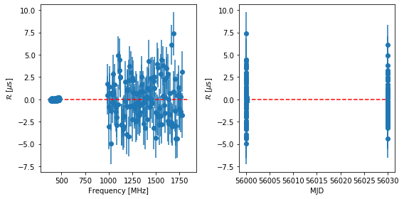

.. code:: python

    print(datetime.now() - startTime)

.. parsed-literal::

    0:01:42.722792

