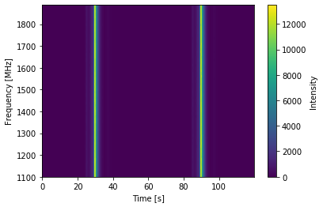
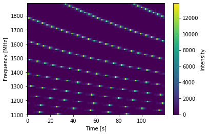
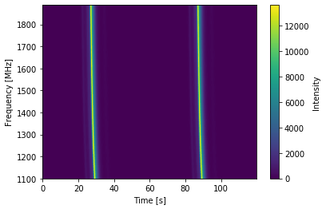
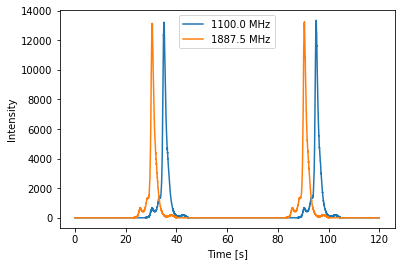
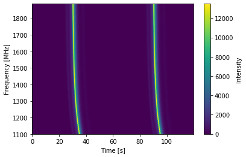
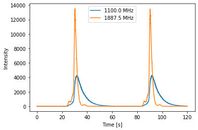
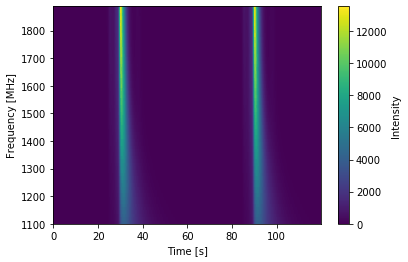
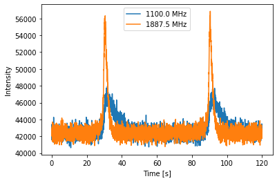
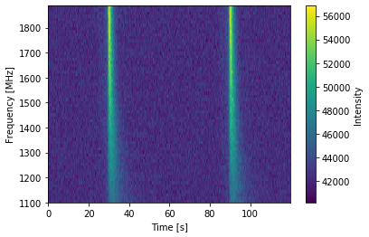

.. note:: This tutorial was generated from a Jupyter notebook that can be
          downloaded `here <_static/notebooks/ism_options_tutorial_4.ipynb>`_.

.. _ism_options_tutorial_4:

ISM Delays: Tutorial 4
======================

This notebook will build on the previous tutorials, showing more
features of the ``PsrSigSim``. Details will be given for new features,
while other features have been discussed in the previous tutorial
notebook. This notebook shows the details of different delays and
effects due to the interstellar medium (ISM) that can be added to the
simulated data.

We again simulate precision pulsar timing data with high signal-to-noise
pulse profiles in order to clearly show the input pulse profile in the
final simulated data product.

.. code:: python

    # import some useful packages
    import numpy as np
    import matplotlib.pyplot as plt
    %matplotlib inline
    
    # import the pulsar signal simulator
    import psrsigsim as pss

Setting up the Folded Signal
----------------------------

Here we will again set up the folded signal class as in previous
introductory tutorials. We will again simulate a 20 minute long
observation total, with subintegrations of 1 minute. The other
simulation parameters will be 64 frequency channels each 12.5 MHz wide
(for 800 MHz bandwidth) observed with the Green Bank Telescope at L-band
(1500 MHz center frequency).

We will simulate a real pulsar, J1713+0747, as we have a premade profile
for this pulsar. The period, dm, and other relavent pulsar parameters
come from the NANOGrav 11-yr data release.

.. code:: python

    # Define our signal variables.
    f0 = 1500 # center observing frequecy in MHz
    bw = 800.0 # observation MHz
    Nf = 64 # number of frequency channels
    # We define the pulse period early here so we can similarly define the frequency
    period = 0.00457 # pulsar period in seconds for J1713+0747
    f_samp = (1.0/period)*2048*10**-6 # sample rate of data in MHz (here 2048 samples across the pulse period
    sublen = 60.0 # subintegration length in seconds, or rate to dump data at
    # Now we define our signal
    signal_1713 = pss.signal.FilterBankSignal(fcent = f0, bandwidth = bw, Nsubband=Nf, sample_rate = f_samp,
                                           sublen = sublen, fold = True) # fold is set to `True`

.. parsed-literal::

    Warning: specified sample rate 0.4481400437636761 MHz < Nyquist frequency 1600.0 MHz

The Pulsar and Profiles
-----------------------

Now we will load the pulse profile as in Tutorial 3 and intilialize a
single ``Pulsar`` object. We will also make the pulses now so that we
can add different ISM effects to them later.

.. code:: python

    # First we load the data array
    path = 'psrsigsim/data/J1713+0747_profile.npy'
    J1713_dataprof = np.load(path)
    
    # Now we define the data profile
    J1713_prof = pss.pulsar.DataProfile(J1713_dataprof)

.. code:: python

    # Define the values needed for the puslar
    Smean = 0.009 # The mean flux of the pulsar, J1713+0747 at 1400 MHz from the ATNF pulsar catatlog, here 0.009 Jy
    psr_name = "J1713+0747" # The name of our simulated pulsar
    
    # Now we define the pulsar with the scaled J1713+0747 profiles
    pulsar_J1713 = pss.pulsar.Pulsar(period, Smean, profiles=J1713_prof, name = psr_name)

.. code:: python

    # define the observation length
    obslen = 60.0*20 # seconds, 20 minutes in total
    # Make the pulses
    pulsar_J1713.make_pulses(signal_1713, tobs = obslen)

The Telescope
-------------

We will set up the ``telescope`` object in the same way as in the
previous tutorials. Since we can set these up in any order, we will do
these first to better show the different ``ISM`` properties later.

.. code:: python

    # We intialize the telescope object as the Green Bank Telescope
    tscope = pss.telescope.telescope.GBT()

The ISM
-------

Here we will initialize the ISM class and show the various different
delays that may be added to the simulated data that are due to the ISM
or are specifically frequency dependent delay. In particular these
include dispersion due to the ISM, delays due to pulse scatter
broadening, and other frequency dependen, or “FD”, parameters as defined
Zhu et al. 2015 and Arzoumanian et al. 2016.

.. code:: python

    # Define the ISM object, note that this class takes no initial arguements
    ism_sim = pss.ism.ISM()

Pulse Dispersion
~~~~~~~~~~~~~~~~

We first show how to add dispersion of pulsars due to the ISM. This has
been shown in previous tutorials as well. To do this, we first define
the dispersion measure, or DM, the number of free electrons along the
line of sight. This follows a frequeny^-2 relation that can be found in
the Handbook of Pulsar Astronomy, by Lorimer and Kramer, 2005. The DM we
use here is the same as in the NANOGrav 11-yr par file for PSR
J1713+0747. We show the pulses both before and after dispersion to show
the effects.

.. code:: python

    # We first plot the first two pulses in frequency-time space to show the undispersed pulses
    time = np.linspace(0, obslen, len(signal_1713.data[0,:]))
    # And the 2-D plot
    plt.imshow(signal_1713.data[:,:4096], aspect = 'auto', interpolation='nearest', origin = 'lower', \
               extent = [min(time[:4096]), max(time[:4096]), signal_1713.dat_freq[0].value, signal_1713.dat_freq[-1].value])
    plt.ylabel("Frequency [MHz]")
    plt.xlabel("Time [s]")
    plt.colorbar(label = "Intensity")
    plt.show()
    plt.close()

.. code:: python

    # Define the dispersion measure
    dm =  15.921200 # pc cm^-3

.. code:: python

    # Now disperse the pulses. Once this is done, the psrsigsim remember that the simulated data have been dispersed.
    ism_sim.disperse(signal_1713, dm)

.. parsed-literal::

    98% dispersed in 0.143 seconds.

.. code:: python

    # Now we can plot the dispersed pulses
    plt.imshow(signal_1713.data[:,:4096], aspect = 'auto', interpolation='nearest', origin = 'lower', \
               extent = [min(time[:4096]), max(time[:4096]), signal_1713.dat_freq[0].value, signal_1713.dat_freq[-1].value])
    plt.ylabel("Frequency [MHz]")
    plt.xlabel("Time [s]")
    plt.colorbar(label = "Intensity")
    plt.show()
    plt.close()

One can clearly see the time delay as a function of observing frequency
that has been added to the signal. However, addition effects can be
added either separtely or in combination with dispersion.

Frequency Dependent Delays
~~~~~~~~~~~~~~~~~~~~~~~~~~

We can also add frequency dependent, or FD, delays to the simulated
data. The formula for these FD parameters can be found in Zhu et
al. 2015 and Arzoumanian et al. 2016. These delays are usually
attributed to pulse profile evolution in frequency, but with the
psrsigsim can also be directly injected into the simulated data without
a frequency dependent pulse ``Portait``.

The input for these delays are a list of coefficients (in units of
seconds) that are used to determine the FD delay as computed in
log-frequency space. FD delays are referenced such that the delay due to
FD parameters is 0 at observing frequencies of 1 GHz.

.. code:: python

    # We can input any number of FD parameters as a list, but we will use the FD parameters in the NANOGrav 11-yr parfile
    FD_J1713 = [-5.68565522e-04, 5.41762131e-04, -3.34764893e-04, 1.35695342e-04, -2.87410591e-05] # seconds

As delays due to FD parameters are usually much smaller than those from
dispersion, we will re-instantiate the pulse signal to better show the
delays added from FD parameters.

.. code:: python

    # Re-make the pulses
    pulsar_J1713.make_pulses(signal_1713, tobs = obslen)
    
    # Now add the FD parameter delay, this takes two arguements, the signal and the list of FD parameters
    ism_sim.FD_shift(signal_1713, FD_J1713)

.. parsed-literal::

    98% shifted in 0.113 seconds.

.. code:: python

    # Show the 2-D plot with the frequency dependent effects
    plt.imshow(signal_1713.data[:,:4096], aspect = 'auto', interpolation='nearest', origin = 'lower', \
               extent = [min(time[:4096]), max(time[:4096]), signal_1713.dat_freq[0].value, signal_1713.dat_freq[-1].value])
    plt.ylabel("Frequency [MHz]")
    plt.xlabel("Time [s]")
    plt.colorbar(label = "Intensity")
    plt.show()
    plt.close()

The shfit here is clearly visible at lower frequencies, though it is
easy to see that the significance of this shift is much smaller than
that from DM.

Scattering Broadening Delays
~~~~~~~~~~~~~~~~~~~~~~~~~~~~

We can also add delays due to pulse scatter broadening to the simulated
data. We can do this two different ways, both of which will be
demonstrated here. The first is by directly shifting the simulated
profile in time by the appropriate scattering delay. The second is by
convolving an exponential scattering tail, based on the input
parameters, and then convolving it with the pulse profile. Both of these
effects are frequency dependent, so the direct shifts are frequency
dependent, and the exponential tails are similarly frequency dependent.

Note that delays from scattering due to the ISM tend to be very small
for low DM pulsars at low radio frequencies, so the scattering delay we
will use here will be largely inflated so the effects are visible
by-eye.

.. code:: python

    # We will first define the scattering timescale and reference frequency for the timescale
    tau_d = 1e-4 # seconds; note this is an unphysical number
    ref_freq = 1500.0 # MHz, reference frequency of the scatter timescale input

Direct Shifting in Time
^^^^^^^^^^^^^^^^^^^^^^^

We start by showing how to directly shift the pulse profiles in time by
the scattering timescale. We note that this does not add any pulse
broadening, it simply shifts the peak of the pulse very slightly. Again,
we remake the signal to better show the scatter broadening separately
from the other ISM effects.

We also note here that ``convolve=False`` and ``pulsar=None`` are
default inputs, and are not necessary for a direct shift.

.. code:: python

    # Re-make the pulses
    pulsar_J1713.make_pulses(signal_1713, tobs = obslen)
    
    # Now add the FD parameter delay, this takes two arguements, the signal and the list of FD parameters
    ism_sim.scatter_broaden(signal_1713, tau_d, ref_freq, convolve = False, pulsar = None)

.. parsed-literal::

    98% scatter shifted in 0.115 seconds.

.. code:: python

    # Now we plot these profiles
    # Since we know there are 2048 bins per pulse period, we can index the appropriate amount
    plt.plot(time[:4096], signal_1713.data[0,:4096], label = signal_1713.dat_freq[0])
    plt.plot(time[:4096], signal_1713.data[-1,:4096], label = signal_1713.dat_freq[-1])
    plt.ylabel("Intensity")
    plt.xlabel("Time [s]")
    plt.legend(loc = 'best')
    plt.show()
    plt.close()
    
    # Show the 2-D plot with the frequency dependent effects
    plt.imshow(signal_1713.data[:,:4096], aspect = 'auto', interpolation='nearest', origin = 'lower', \
               extent = [min(time[:4096]), max(time[:4096]), signal_1713.dat_freq[0].value, signal_1713.dat_freq[-1].value])
    plt.ylabel("Frequency [MHz]")
    plt.xlabel("Time [s]")
    plt.colorbar(label = "Intensity")
    plt.show()
    plt.close()

We can see the signal has been shifted in time as a function of
frequency in both the profiles and in the 2-D power spectrum. But the
input profiles themselves remain unchanged from the input profile,
e.g. no eponential scattering convolution as been done.

Scattering Tail Convolution
^^^^^^^^^^^^^^^^^^^^^^^^^^^

Here we show how to scatter broaden the profiles themselves in order to
add pulse scatter broadening delays. The inputs necessary to do this are
very similar to dierectly shifting it, with the addition of changing
``convolve=True`` and adding the ``Pulsar`` object as input. Because
this acts directly on the profiles, this must be done before
``make_pulses()`` is run, and cannot be undone.

We also note that the number of input profile channels must match the
number of channels specified in the ``Signal``. Here this is 64
channels, so we can reinstantiate the profile including the ``Nchan=64``
flag, and then make the pulsar again.

.. code:: python

    # Now we define the data profile
    J1713_prof = pss.pulsar.DataProfile(J1713_dataprof, Nchan=64)
    
    # Now we define the pulsar with the scaled J1713+0747 profiles
    pulsar_J1713 = pss.pulsar.Pulsar(period, Smean, profiles=J1713_prof, name = psr_name)
    
    # Now add the FD parameter delay, this takes two arguements, the signal and the list of FD parameters
    ism_sim.scatter_broaden(signal_1713, tau_d, ref_freq, convolve = True, pulsar = pulsar_J1713)
    
    # Re-make the pulses
    pulsar_J1713.make_pulses(signal_1713, tobs = obslen)

.. code:: python

    # Now we plot these profiles
    # Since we know there are 2048 bins per pulse period, we can index the appropriate amount
    plt.plot(time[:4096], signal_1713.data[0,:4096], label = signal_1713.dat_freq[0])
    plt.plot(time[:4096], signal_1713.data[-1,:4096], label = signal_1713.dat_freq[-1])
    plt.ylabel("Intensity")
    plt.xlabel("Time [s]")
    plt.legend(loc = 'best')
    plt.show()
    plt.close()
    
    # Show the 2-D plot with the frequency dependent effects
    plt.imshow(signal_1713.data[:,:4096], aspect = 'auto', interpolation='nearest', origin = 'lower', \
               extent = [min(time[:4096]), max(time[:4096]), signal_1713.dat_freq[0].value, signal_1713.dat_freq[-1].value])
    plt.ylabel("Frequency [MHz]")
    plt.xlabel("Time [s]")
    plt.colorbar(label = "Intensity")
    plt.show()
    plt.close()

We can see now that the scattering tails have been convolved with the
actual profiles, and this shows up in both the individual pulse
profiles, which clearly show a shift in the peak of the pulse, as well
as in the power spectrum, where the profile is clearly getting scattered
out.

Simulating the Scatter Broadened Pulsar
---------------------------------------

Now we will finish by ``observe``\ ing the pulsar and looking at the
data with the added noise.

.. code:: python

    # Observe with the telescope
    tscope.observe(signal_1713, pulsar_J1713, system="Lband_GUPPI", noise=True)

.. code:: python

    # Since we know there are 2048 bins per pulse period, we can index the appropriate amount
    plt.plot(time[:4096], signal_1713.data[0,:4096], label = signal_1713.dat_freq[0])
    plt.plot(time[:4096], signal_1713.data[-1,:4096], label = signal_1713.dat_freq[-1])
    plt.ylabel("Intensity")
    plt.xlabel("Time [s]")
    plt.legend(loc = 'best')
    plt.show()
    plt.close()
    
    # And the 2-D plot
    plt.imshow(signal_1713.data[:,:4096], aspect = 'auto', interpolation='nearest', origin = 'lower', \
               extent = [min(time[:4096]), max(time[:4096]), signal_1713.dat_freq[0].value, signal_1713.dat_freq[-1].value])
    plt.ylabel("Frequency [MHz]")
    plt.xlabel("Time [s]")
    plt.colorbar(label = "Intensity")
    plt.show()
    plt.close()

