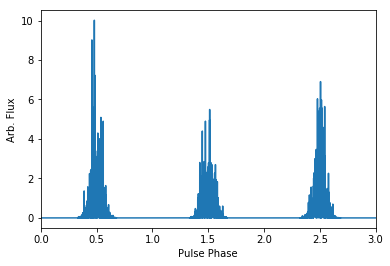
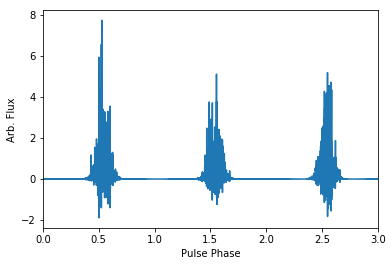
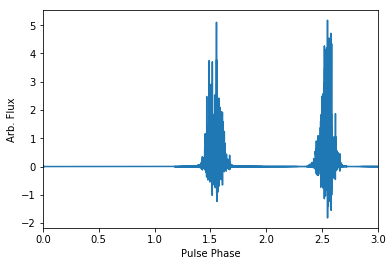
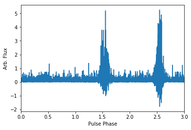

.. note:: This tutorial was generated from a Jupyter notebook that can be
          downloaded `here <_static/notebooks/pulse_nulling_example.ipynb>`_.

.. _pulse_nulling_example:

Pulse Nulling: Example Notebook
===============================

This notebook will serve as an exampe of how to use the pulse nulling
feature of the ``Pulse Signal Simulator``.

.. code:: python

    # Start by importing the packages we will need for the simulation.
    import psrsigsim as pss

    # Additional necessary packages
    import numpy as np
    import matplotlib.pyplot as plt
    # helpful magic lines
    %matplotlib inline

We define a plotting convenience function for later.

.. code:: python

    # Define a function for easier plotting later on/throughout the testing
    def plotsignal(signals, nbins=2048):
        # signals can be a list of multiple signals to overplot
        for ii in range(len(signals)):
            # Define the x axis
            phases = np.linspace(0.0, len(signals[ii]), len(signals[ii]))/nbins
            # now plot it
            plt.plot(phases, signals[ii], label="signal %s" % (ii))
        plt.xlim([0.0, np.max(phases)])
        plt.xlabel("Pulse Phase")
        plt.ylabel("Arb. Flux")
        plt.show()
        plt.close()

Now we will define some example simulation parameters. The warning
generated below may be ignored.

.. code:: python

    # define the required filterbank signal parameters
    f0 = 1380 # center observing frequecy in MHz
    bw = 800.0 # observation MHz
    Nf = 2 # number of frequency channels
    F0 = np.double(1.0) # pulsar frequency in Hz
    f_samp = F0*2048*10**-6 # sample rate of data in MHz, here 2048 bins across the pulse
    subintlen = 1.0 # desired length of fold-mode subintegration in seconds
    # Now we define our signal
    null_signal = pss.signal.FilterBankSignal(fcent = f0, bandwidth = bw, Nsubband=Nf,\
                                              sample_rate=f_samp, fold=True, sublen=subintlen)

.. parsed-literal::

    Warning: specified sample rate 0.002048 MHz < Nyquist frequency 1600.0 MHz

Now we define an example Gaussian pulse shape. Details on defining a
pulse shape from a data array may be found in the exmample notebook in
the docs.

.. code:: python

    prof = pss.pulsar.GaussProfile(peak=0.5, width=0.05, amp=1.0)

Now we define an example pulsar

.. code:: python

    # Define the necessary parameters
    period = np.double(1.0)/F0 # seconds
    flux = 0.1 # Jy
    psr_name = "J0000+0000"
    # Define the pulsar object
    pulsar = pss.pulsar.Pulsar(period=period, Smean=flux, profiles=prof, name=psr_name)

Now we actually make the pulsar signal. Note that if the observation
length is very long all the data will be saved in memory which may crash
the computer or slow it down significantly.

.. code:: python

    # Define the observation time, in seconds
    ObsTime = 3.0 # seconds
    # make the pulses
    pulsar.make_pulses(null_signal, tobs = ObsTime)

Now lets take a look at what the signals look like.

.. code:: python

    # We plot just the first frequency channel, but all pulses simulated
    plotsignal([null_signal.data[0,:]])

Now we can disperse the simuated data if desired. Note that this is not
required, and if you only want to simulate a single frequency channel or
simulate coherently dedispersed data, the data does not have to be
dispersed.

.. code:: python

    # First define the dispersion measure
    dm = 10.0 # pc cm^-3
    # Now define the ISM class
    ism_ob = pss.ism.ISM()
    # Now we give the ISM class the signal and disperse the data
    ism_ob.disperse(null_signal, dm)
    # If we plot the same pulses as above, you can see that the phase of the pulse has
    # been shfited due to the dispersion
    plotsignal([null_signal.data[0,:]])

.. parsed-literal::

    100% dispersed in 0.001 seconds.

This is where the pulses should be nulled if desired. This can be run
easily by giving the pulsar object only the signal class and the null
fraction as a value between 0 and 1. The simulator will null as close to
the null fraction as desired, and will round to the closest integer
number of pulses to null based on the input nulling fraction, e.g. if 5
pulses are simulated and the nulling fraction is 0.5, it will round to
null 3 pulses. Additionally, currently only the ability to null the
pulses randomly is implemented.

Here we will put in a nulling fraction of 33%

.. code:: python

    pulsar.null(null_signal, 0.34)

.. code:: python

    # and plot the signal to show the null
    plotsignal([null_signal.data[0,:]])

We can also add radiometer noise from some observing telescope. This
should only be run AFTER the pulsar nulling, but is not required. For
our example, we will use the L-band feed for the Arecibo telescope. Note
that here since we have set the pulsar flux very high we can easily see
the single pulses above the noise.

.. code:: python

    # We define the telescope object
    tscope = pss.telescope.telescope.Arecibo()
    # Now add radiometer noise; ignore the output here, the noise is added directly to the signal
    output = tscope.observe(null_signal, pulsar, system="Lband_PUPPI", noise=True)
    # and plot the signal to show the added noise
    plotsignal([null_signal.data[0,:]])

.. parsed-literal::

    WARNING: AstropyDeprecationWarning: The truth value of a Quantity is ambiguous. In the future this will raise a ValueError. [astropy.units.quantity]

Now we can save the data in a ``PSRCHIVE pdv`` format. This is done with
the ``txtfile`` class. The save function will dump a new file for every
100 pulses that it writes to the text file. We start by initializing the
``txtfile`` object. The only input needed here is the ``path`` variable,
which will tell the simulator where to save the data. All files saved
will have "_#.txt" added to the end of the ``path`` variable.

.. code:: python

    txtfile = pss.io.TxtFile(path="PsrSigSim_Simulated_Pulsar.ar")
    # Now we call the saving function. Note that depending on the length of the simulated data this may take awhile
    # the two inputs are the signal and the pulsar objects used to simulate the data.
    txtfile.save_psrchive_pdv(null_signal, pulsar)

And that’s all that there should be to it. Let us know if you have any
questions moving forward, or if something is not working as it should
be.
