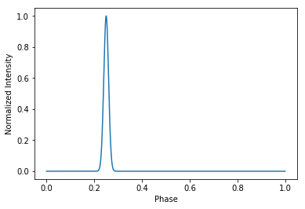
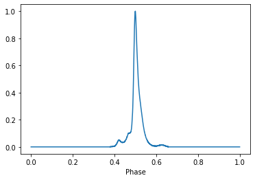
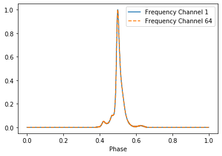
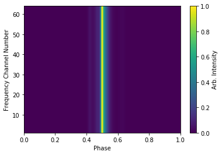
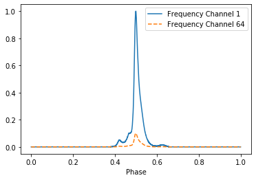
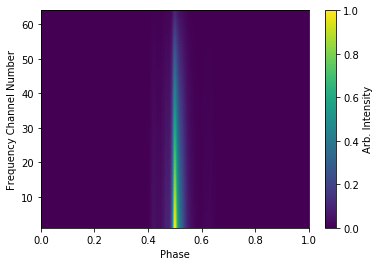
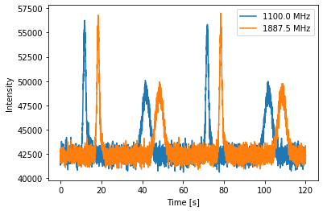
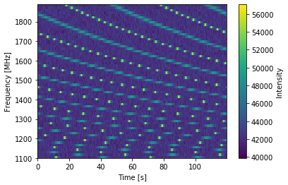
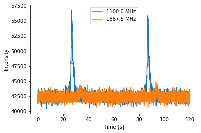
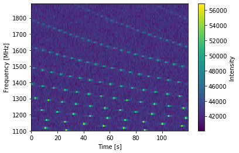

.. note:: This tutorial was generated from a Jupyter notebook that can be
          downloaded `here <_static/notebooks/pulse_profiles_tutorial_3.ipynb>`_.

.. _pulse_profiles_tutorial_3:

Pulse Profiles: Introductory Tutorial 3
=======================================

This notebook will build on the previous tutorials, showing more
features of the ``PsrSigSim``. Details will be given for new features,
while other features have been discussed in the previous tutorial
notebook. This notebook shows the details of different methods of
defining pulse profiles for simulated pulsars. This is useful for
simulating realisitic pulse profiles and pulse profile evolution (with
observing frequency.)

We again simulate precision pulsar timing data with high signal-to-noise
pulse profiles in order to clearly show the input pulse profile in the
final simulated data product.

.. code:: python

    # import some useful packages
    import numpy as np
    import matplotlib.pyplot as plt
    %matplotlib inline
    
    # import the pulsar signal simulator
    import psrsigsim as pss

Setting up the Folded Signal
----------------------------

Here we will again set up the folded signal class as in the second
introductory tutorial. We will again simulate a 20 minute long
observation total, with subintegrations of 1 minute. The other
simulation parameters will be 64 frequency channels each 12.5 MHz wide
(for 800 MHz bandwidth) observed with the Green Bank Telescope at L-band
(1500 MHz center frequency).

However, as part of this tutorial, we will simulate a real pulsar,
J1713+0747, as we have a premade profile for this pulsar. The period,
dm, and other relavent pulsar parameters come from the NANOGrav 11-yr
data release.

.. code:: python

    # Define our signal variables.
    f0 = 1500 # center observing frequecy in MHz
    bw = 800.0 # observation MHz
    Nf = 64 # number of frequency channels
    # We define the pulse period early here so we can similarly define the frequency
    period = 0.00457 # pulsar period in seconds for J1713+0747
    f_samp = (1.0/period)*2048*10**-6 # sample rate of data in MHz (here 2048 samples across the pulse period
    sublen = 60.0 # subintegration length in seconds, or rate to dump data at
    # Now we define our signal
    signal_1713 = pss.signal.FilterBankSignal(fcent = f0, bandwidth = bw, Nsubband=Nf, sample_rate = f_samp,
                                           sublen = sublen, fold = True) # fold is set to `True`

.. parsed-literal::

    Warning: specified sample rate 0.4481400437636761 MHz < Nyquist frequency 1600.0 MHz

The ISM and Telescope
---------------------

Here we set up ``ISM`` and ``telescope`` objects in the same way as in
the previous tutorial. Since we can set these up in any order, we will
do these first to better show the different pulse profiles later.

.. code:: python

    # Define the dispersion measure
    dm =  15.921200 # pc cm^-3
    # And define the ISM object, note that this class takes no initial arguements
    ism_fold = pss.ism.ISM()
    
    # We intialize the telescope object as the Green Bank Telescope
    tscope = pss.telescope.telescope.GBT()

Pulse Profiles
--------------

In previous tutorials, we have defined a very simple Gaussian profile as
the pulse profile. However, the ``PsrSigSim`` allows users to define
profiles in a few different ways, including multiple Gaussians, a user
input profile in the form of a Python array, and two dimensional
versions of the pulse profiles called pulse portaits.

We will go through a few different ways to set up the pulse profiles,
and then will simulate different initial pulsars and the subsequent
data, through the full pipeline.

Gaussian Profiles
~~~~~~~~~~~~~~~~~

The first method is the Gaussian profile, which has been demonstrated in
previous tutorials. The Guassian needs three parameters, an amplitude, a
width (or sigma), and a peak, the center of the Gaussian in phase space
(e.g. 0-1). The simplest profile that can be defined is a single
Gauassian.

.. code:: python

    gauss_prof = pss.pulsar.GaussProfile(peak = 0.25, width = 0.01, amp = 1.0)

Defining the profile just tells the simulator how to make the pulses. If
we want to see what they look like, we need to initialize the profile,
and then we can give it a number of phase bins and plot it.

.. code:: python

    # We want to use 2048 phase bins and just one frequency channel for this test.
    gauss_prof.init_profiles(2048, Nchan = 1)

.. code:: python

    # And then we can plot the array to see what the profile looks like
    plt.plot(np.linspace(0,1,2048), gauss_prof.profiles[0])
    plt.xlabel("Phase")
    plt.show()
    plt.close()

However the Gaussian profile can also be used to make a pulse profile
with multiple Gaussian components. Instead of inputting a single value
into each of the three fields (peak, width, amp), we input an array of
the corresponding values, e.g. the second value in each array are the
components of the second Gaussian component. Below we build on the
previous single Gaussian profile by adding a small “shoulder” to the
main pulse profile, as well as a broad interpulse to the profile.

Note - curently the input for multiple Gaussian components must be an
array, it cannot be a list.

.. code:: python

    # Define the number and value of each Gaussain component
    peaks = np.array([0.25, 0.28, 0.75])
    widths = np.array([0.01, 0.01, 0.03])
    amps = np.array([1.0, 0.1, 0.5])
    
    # Define the profile using multiple Gaussians
    mulit_gauss_prof = pss.pulsar.GaussProfile(peak = peaks, width = widths, amp = amps)
    # We want to use 2048 phase bins and just one frequency channel for this test.
    mulit_gauss_prof.init_profiles(2048, Nchan = 1)
    # And then we can plot the array to see what the profile looks like
    plt.plot(np.linspace(0,1,2048), mulit_gauss_prof.profiles[0])
    plt.xlabel("Phase")
    plt.show()
    plt.close()

.. image:: pulse_profiles_tutorial_3_files/pulse_profiles_tutorial_3_13_0.png

Data Profiles
~~~~~~~~~~~~~

The PsrSigSim can also take arrays of data points as the pulse profile
in what is called a ``DataProfile``. This array represents pulse profile
and may be used to define the pulse profile shape. The number of bins in
the input data profile does not need to be the equivalent to the input
sampling rate. This option may be useful when simulating real pulsars or
realistic pulsar data.

Here we will use a premade profile of the pulsar J1713+0747 as the pulse
profile.

.. code:: python

    # First we load the data array
    path = 'psrsigsim/data/J1713+0747_profile.npy'
    J1713_dataprof = np.load(path)
    
    # Now we define the data profile
    J1713_prof = pss.pulsar.DataProfile(J1713_dataprof)
    # Now we can initialize and plot the profile the same way as the Gaussian profile
    J1713_prof.init_profiles(2048, Nchan = 1)
    # And then we can plot the array to see what the profile looks like
    plt.plot(np.linspace(0,1,2048), J1713_prof.profiles[0])
    plt.xlabel("Phase")
    plt.show()
    plt.close()

Data Portraits
~~~~~~~~~~~~~~

While the ``Profile`` objects initialize a 1-D pulse profile, there are
also ``Portrait`` objects that have the ability to initialize a 2-D
pulse profile. A ``Profile`` object will use the same pulse profile for
every simulated frequency channel, while a ``Portrait`` can use
different versions of the profile at different frequencies.

To illustrate this, we will initialize a pulse ``Portrat`` for
J1713+0747 where they are scaled in power. We start by showing how a
pulse ``Profile`` uses the same profile at every frequency, then how a
``Portrait`` is initialized, and finally, how different profiles may be
input at each frequency using a pulse ``Portrait``.

Using the same profile as above, we will initialize a multi-frequency
profile, and show that it has the same shape and power at different
frequencies.

.. code:: python

    # Initialize a multi-channel profile
    J1713_prof.init_profiles(2048, Nchan = 64)
    # And then we can plot the array to see what the profile looks like
    plt.plot(np.linspace(0,1,2048), J1713_prof.profiles[0], label = "Frequency Channel 1")
    plt.plot(np.linspace(0,1,2048), J1713_prof.profiles[-1], ls = '--', label = "Frequency Channel 64")
    plt.xlabel("Phase")
    plt.legend(loc='best')
    plt.show()
    plt.close()

It is easy to see that the two profiles are identical. If we plot a 2-D
image of the profile phase as a function of frequency channel, we can
see that they are all identical.

.. code:: python

    plt.imshow(J1713_prof.profiles, aspect = 'auto', interpolation='nearest', origin = 'lower', \
               extent = [0.0, 1.0, 1, 64])
    plt.ylabel("Frequency Channel Number")
    plt.xlabel("Phase")
    plt.colorbar(label = "Arb. Intensity")
    plt.show()
    plt.close()

We can similarly initialize a pulse ``Portait``. Here we will first
create a mulitdimensional array of pulse profile, as well as an array to
scale them by. We will then initialize a pulse ``Portrait`` object and
show that the profiles generated retain the scaling.

.. code:: python

    # Make a 2-D array of the profiles
    J1713_dataprof_2D = np.tile(J1713_dataprof, (64,1))
    # Now we scale them linearly so that lower frequency channels are "brighter"
    scaling = np.reshape(np.linspace(1.0, 0.1, 64), (64,1))
    J1713_dataprof_2D *= scaling
    # Now we make a `Portrait`
    J1713_prof_2D = pss.pulsar.DataPortrait(J1713_dataprof_2D)
    # Now we initialize the profiles
    J1713_prof_2D.init_profiles(2048, 64)

.. code:: python

    # Now we can plot the first and last profile, as well as the 2-D power of the input profiles at each frequency
    # And then we can plot the array to see what the profile looks like
    plt.plot(np.linspace(0,1,2048), J1713_prof_2D.profiles[0], label = "Frequency Channel 1")
    plt.plot(np.linspace(0,1,2048), J1713_prof_2D.profiles[-1], ls = '--', label = "Frequency Channel 64")
    plt.xlabel("Phase")
    plt.legend(loc='best')
    plt.show()
    plt.close()
    # And the 2-D image
    plt.imshow(J1713_prof_2D.profiles, aspect = 'auto', interpolation='nearest', origin = 'lower', \
               extent = [0.0, 1.0, 1, 64])
    plt.ylabel("Frequency Channel Number")
    plt.xlabel("Phase")
    plt.colorbar(label = "Arb. Intensity")
    plt.show()
    plt.close()

We can see that the generated profiles then retain the scaling they have
been given. This is just a simplistic version of what can be done, using
the ``Portrait`` class.

Pulsars
-------

Now we will set up a few different ``Pulsar`` classes and simulate the
full dataset, showing how the input profiles are retained through the
process of dispersion and adding noise to the simulated data.

.. code:: python

    # Define the values needed for the puslar
    Smean = 0.009 # The mean flux of the pulsar, J1713+0747 at 1400 MHz from the ATNF pulsar catatlog, here 0.009 Jy
    psr_name_1 = "J0000+0000" # The name of our simulated pulsar with a mulit-gaussian profile
    psr_name_2 = "J1713+0747" # The name of our simulated pulsar with a scaled, 2-D profile
    
    # Now we define the pulsar with multiple Gaussian defineing is profile
    pulsar_mg = pss.pulsar.Pulsar(period, Smean, profiles=mulit_gauss_prof, name = psr_name_1)
    
    # Now we define the pulsar with the scaled J1713+0747 profiles
    pulsar_J1713 = pss.pulsar.Pulsar(period, Smean, profiles=J1713_prof_2D, name = psr_name_2)

Simulations
-----------

We run the rest of the simulation, including dispersion and “observing”
with our telescope. The same parameters are used for both ``Pulsar``\ s
and simulated data sets with the only difference being the input
profiles. We then show the resutls of each simulation and how they
retain the intial input profile shapes.

We first run the simultion for our fake mulit-gaussian profile pulsar.

.. code:: python

    # define the observation length
    obslen = 60.0*20 # seconds, 20 minutes in total
    # Make the pulses
    pulsar_mg.make_pulses(signal_1713, tobs = obslen)
    # Disperse the data
    ism_fold.disperse(signal_1713, dm)
    # Observe with the telescope
    tscope.observe(signal_1713, pulsar_mg, system="Lband_GUPPI", noise=True)

.. parsed-literal::

    98% dispersed in 0.122 seconds.

.. parsed-literal::

    WARNING: AstropyDeprecationWarning: The truth value of a Quantity is ambiguous. In the future this will raise a ValueError. [astropy.units.quantity]

.. code:: python

    # Now we plot these profiles
    # Get the phases of the pulse
    time = np.linspace(0, obslen, len(signal_1713.data[0,:]))
    # Since we know there are 2048 bins per pulse period, we can index the appropriate amount
    plt.plot(time[:4096], signal_1713.data[0,:4096], label = signal_1713.dat_freq[0])
    plt.plot(time[:4096], signal_1713.data[-1,:4096], label = signal_1713.dat_freq[-1])
    plt.ylabel("Intensity")
    plt.xlabel("Time [s]")
    plt.legend(loc = 'best')
    plt.show()
    plt.close()
    
    # And the 2-D plot
    plt.imshow(signal_1713.data[:,:4096], aspect = 'auto', interpolation='nearest', origin = 'lower', \
               extent = [min(time[:4096]), max(time[:4096]), signal_1713.dat_freq[0].value, signal_1713.dat_freq[-1].value])
    plt.ylabel("Frequency [MHz]")
    plt.xlabel("Time [s]")
    plt.colorbar(label = "Intensity")
    plt.show()
    plt.close()

It is clear that we have maintianed the initial shape of this profile.
Now we will do the same thing but with the scaled 2-D pulse ``Portrait``
pulsar.

.. code:: python

    # We first must redefine the input signal
    signal_1713 = pss.signal.FilterBankSignal(fcent = f0, bandwidth = bw, Nsubband=Nf, sample_rate = f_samp,
                                           sublen = sublen, fold = True) # fold is set to `True`
    
    # define the observation length
    obslen = 60.0*20 # seconds, 20 minutes in total
    # Make the pulses
    pulsar_J1713.make_pulses(signal_1713, tobs = obslen)
    # Disperse the data
    ism_fold.disperse(signal_1713, dm)
    # Observe with the telescope
    tscope.observe(signal_1713, pulsar_J1713, system="Lband_GUPPI", noise=True)

.. parsed-literal::

    Warning: specified sample rate 0.4481400437636761 MHz < Nyquist frequency 1600.0 MHz
    98% dispersed in 0.115 seconds.

.. parsed-literal::

    WARNING: AstropyDeprecationWarning: The truth value of a Quantity is ambiguous. In the future this will raise a ValueError. [astropy.units.quantity]

.. code:: python

    # Now we plot these profiles
    # Get the phases of the pulse
    time = np.linspace(0, obslen, len(signal_1713.data[0,:]))
    # Since we know there are 2048 bins per pulse period, we can index the appropriate amount
    plt.plot(time[:4096], signal_1713.data[0,:4096], label = signal_1713.dat_freq[0])
    plt.plot(time[:4096], signal_1713.data[-1,:4096], label = signal_1713.dat_freq[-1])
    plt.ylabel("Intensity")
    plt.xlabel("Time [s]")
    plt.legend(loc = 'best')
    plt.show()
    plt.close()
    
    # And the 2-D plot
    plt.imshow(signal_1713.data[:,:4096], aspect = 'auto', interpolation='nearest', origin = 'lower', \
               extent = [min(time[:4096]), max(time[:4096]), signal_1713.dat_freq[0].value, signal_1713.dat_freq[-1].value])
    plt.ylabel("Frequency [MHz]")
    plt.xlabel("Time [s]")
    plt.colorbar(label = "Intensity")
    plt.show()
    plt.close()

Here it is clear the the scaling has also been maintained, with lower
frequency pulses being brighter than high frequency pulses.

