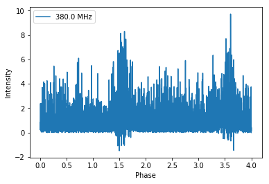
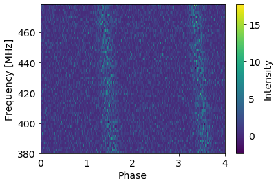
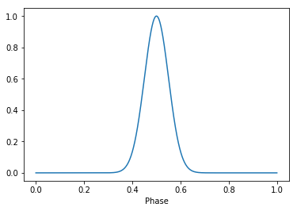
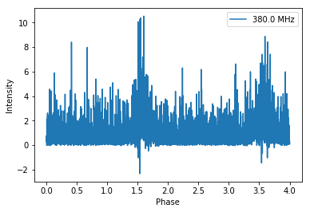
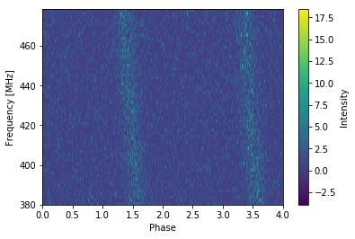

.. note:: This tutorial was generated from a Jupyter notebook that can be
          downloaded `here <_static/notebooks/simulate_tutorial.ipynb>`_.

.. _simulate_tutorial:

Simulation Class: Tutorial 6
============================

This notebook will demonstrate how to use the ``Simulation`` class of
the pulsar signal simulator for more automated simulation of data. The
``Simulation`` class is designed as a convenience class within the
``PsrSigSim``. Instead of instantiating each step of the simulation, the
``Simulation`` class allows the input of all desired variables for the
simulation at once, and then will run all parts of the simulation. The
``Simulation`` class also allows for individual running of each step
(e.g. ``Signal``, ``Pulsar``, etc.) if desired. Not all options
available within the ``Simulation`` will be demonstrated in this
notebook.

.. code:: python

    # import some useful packages
    import numpy as np
    import matplotlib.pyplot as plt
    %matplotlib inline
    
    # import the pulsar signal simulator
    import psrsigsim as pss

Instead of defining each variable individually, the simulation class
gets instantiated all at once. This can be done either by defining each
variable individually, or by passing a dictionary with all parameters
defined to the simulator. The dictionary keys should be the same as the
input flags for the ``Simulation`` class.

.. code:: python

    sim = pss.simulate.Simulation(
                     fcent = 430, # center frequency of observation, MHz
                     bandwidth = 100, # Bandwidth of observation, MHz
                     sample_rate = 1.0*2048*10**-6, # Sampling rate of the data, MHz
                     dtype = np.float32, # data type to write out the signal in
                     Npols = 1, # number of polarizations to simulate, only one available
                     Nchan = 64, # number of subbands for the observation
                     sublen = 2.0, # length of subintegration of signal
                     fold = True, # flag to produce fold-mode, subintegrated data
                     period = 1.0, # pulsar period in seconds
                     Smean = 1.0, # mean flux of the pulsar in Jy
                     profiles = [0.5, 0.05, 1.0], # Profile - may be a data array, list of Gaussian components, or profile class object
                     tobs = 4.0, # length of observation in seconds
                     name = 'J0000+0000', # name of the simulated pulsar
                     dm = 10.0, # dispersion measure in pc cm^-3
                     tau_d = None, # scattering timescale in seconds
                     tau_d_ref_f = None, # reference frequency of scattering timescale in seconds
                     aperture = 100.0, # telescope aperture in meters
                     area = 5500.0, # telescope area in meters square
                     Tsys = 35.0, # telescope system temperature
                     tscope_name = "TestScope", # telescope name (default GBT and Arecibo available)
                     system_name = "TestSys", # observing system name
                     rcvr_fcent = 430, # center frequency of the receiver in MHz
                     rcvr_bw = 100, # receiver bandwidth in MHz
                     rcvr_name ="TestRCVR", # name of receiver
                     backend_samprate = 1.5625, # bandend maximum sampling rate in MHz
                     backend_name = "TestBack", # bandend name
                     tempfile = None, # optional name of template fits file to simulate
                     psrdict = None, # optional dictionary to give for input parameters
                     )

To give the ``Simulation`` class a dictionary of these parameters, the
input may look something like below (Note - all parameters have the same
units and names as above).

.. code:: python

    pdict = {'fcent' : 430,
             'bandwidth' : 100,
             'sample_rate' : 1.0*2048*10**-6,
             'dtype' : np.float32,
             'Npols' : 1,
             'Nchan' : 64,
             'sublen' : 2.0,
             'fold' : True,
             'period' : 1.0,
             'Smean' : 1.0,
             'profiles' : [0.5, 0.05, 1.0],
             'tobs' : 4.0,
             'name' : 'J0000+0000',
             'dm' : 10.0,
             'tau_d' : None,
             'tau_d_ref_f' : None,
             'aperture' : 100.0,
             'area' : 5500.0,
             'Tsys' : 35.0,
             'tscope_name' : "TestScope",
             'system_name' : "TestSys",
             'rcvr_fcent' : 430,
             'rcvr_bw' : 100,
             'rcvr_name' : "TestRCVR",
             'backend_samprate' : 1.5625,
             'backend_name' : "TestBack",
             'tempfile' : None,
            }
    
    sim = pss.simulate.Simulation(psrdict = pdict)

Simulating the Data
-------------------

Once the ``Simulation`` class is initialized with all of the necessary
parameters, there are two ways to run the simulation. The first is
simply by running the ``simulate()`` function, which will fully simulate
the the data from start to finish.

.. code:: python

    sim.simulate()

.. parsed-literal::

    Warning: specified sample rate 0.002048 MHz < Nyquist frequency 200.0 MHz
    98% dispersed in 0.050 seconds.

.. parsed-literal::

    WARNING: AstropyDeprecationWarning: The truth value of a Quantity is ambiguous. In the future this will raise a ValueError. [astropy.units.quantity]

If we want to look at the data that has been simulated, it can be
accessed via ``sim.signal.data``. The simulate class has attributes for
each of the objects simulated (e.g. ``signal``, ``pulsar``, etc.) if the
user would like to access those parameters. We will look at the
simulated data and plot it below.

.. code:: python

    # We can look at the simulated profiles
    plt.plot(np.linspace(0,1,2048), sim.profiles.profiles[0])
    plt.xlabel("Phase")
    plt.show()
    plt.close()

.. image:: simulate_tutorial_files/simulate_tutorial_9_0.png

.. code:: python

    # Get the simulated data
    sim_data = sim.signal.data
    
    # Get the phases of the pulse
    phases = np.linspace(0, sim.tobs/sim.period, len(sim_data[0,:]))
    # Plot just the pulses in the first frequency channels
    plt.plot(phases, sim_data[0,:], label = sim.signal.dat_freq[0])
    plt.ylabel("Intensity")
    plt.xlabel("Phase")
    plt.legend(loc = 'best')
    plt.show()
    plt.close()
    
    # Make the 2-D plot of intensity v. frequency and pulse phase. You can see the slight dispersive sweep here.
    plt.imshow(sim_data, aspect = 'auto', interpolation='nearest', origin = 'lower', \
               extent = [min(phases), max(phases), sim.signal.dat_freq[0].value, sim.signal.dat_freq[-1].value])
    plt.ylabel("Frequency [MHz]")
    plt.xlabel("Phase")
    plt.colorbar(label = "Intensity")
    plt.show()
    plt.close()

A second way to simulate
~~~~~~~~~~~~~~~~~~~~~~~~

The second way to run these simulations is by initializing all of the
different objects separately, instead of through the simulation class.
This allows slightly more freedom, as well as modifications to the
initially input simulated parameters.

.. code:: python

    # We start by initializing the signal
    sim.init_signal()
    # Initialize the profile
    sim.init_profile()
    # Now the pulsar
    sim.init_pulsar()
    # Now the ISM
    sim.init_ism()
    # Now make the pulses
    sim.pulsar.make_pulses(sim.signal, tobs = sim.tobs)
    # disperse the simulated pulses
    sim.ism.disperse(sim.signal, sim.dm)
    # Now add the telescope and radiometer noise
    sim.init_telescope()
    # add radiometer noise
    out_array = sim.tscope.observe(sim.signal, sim.pulsar, system=sim.system_name, noise=True)

.. parsed-literal::

    Warning: specified sample rate 0.002048 MHz < Nyquist frequency 200.0 MHz
    98% dispersed in 0.055 seconds.

.. parsed-literal::

    WARNING: AstropyDeprecationWarning: The truth value of a Quantity is ambiguous. In the future this will raise a ValueError. [astropy.units.quantity]

If we plot the results here we find that they are identical within the
error of the simulated noise to what we have above.

.. code:: python

    # We can look at the simulated profiles
    plt.plot(np.linspace(0,1,2048), sim.profiles.profiles[0])
    plt.xlabel("Phase")
    plt.show()
    plt.close()
    
    # Get the simulated data
    sim_data = sim.signal.data
    
    # Get the phases of the pulse
    phases = np.linspace(0, sim.tobs/sim.period, len(sim_data[0,:]))
    # Plot just the pulses in the first frequency channels
    plt.plot(phases, sim_data[0,:], label = sim.signal.dat_freq[0])
    plt.ylabel("Intensity")
    plt.xlabel("Phase")
    plt.legend(loc = 'best')
    plt.show()
    plt.close()
    
    # Make the 2-D plot of intensity v. frequency and pulse phase. You can see the slight dispersive sweep here.
    plt.imshow(sim_data, aspect = 'auto', interpolation='nearest', origin = 'lower', \
               extent = [min(phases), max(phases), sim.signal.dat_freq[0].value, sim.signal.dat_freq[-1].value])
    plt.ylabel("Frequency [MHz]")
    plt.xlabel("Phase")
    plt.colorbar(label = "Intensity")
    plt.show()
    plt.close()

