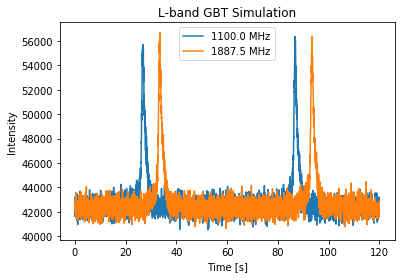
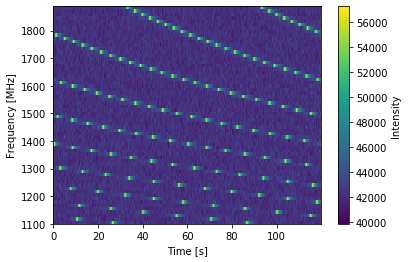
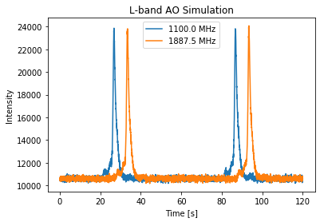
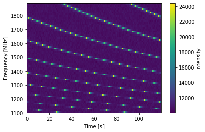
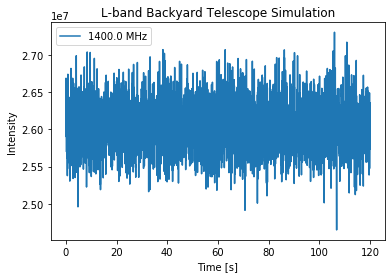

.. note:: This tutorial was generated from a Jupyter notebook that can be
          downloaded `here <_static/notebooks/telescopes_tutorial_5.ipynb>`_.

.. _telescopes_tutorial_5:

Telescopes: Tutorial 5
======================

This notebook will build on the previous tutorials, showing more
features of the ``PsrSigSim``. Details will be given for new features,
while other features have been discussed in the previous tutorial
notebook. This notebook shows the details of different telescopes
currently included in the ``PsrSigSim``, how to call them, and how to
define a user ``telescope`` for a simulated observation.

We again simulate precision pulsar timing data with high signal-to-noise
pulse profiles in order to clearly show the input pulse profile in the
final simulated data product. We note that the use of different
telescopes will result in different signal strengths, as would be
expected.

This example will follow previous notebook in defining all necessary
classes except for ``telescope``.

.. code:: python

    # import some useful packages
    import numpy as np
    import matplotlib.pyplot as plt
    %matplotlib inline
    
    # import the pulsar signal simulator
    import psrsigsim as pss

The Folded Signal
-----------------

Here we will use the same ``Signal`` definitions that have been used in
the previous tutorials. We will again simulate a 20 minute long
observation total, with subintegrations of 1 minute. The other
simulation parameters will be 64 frequency channels each 12.5 MHz wide
(for 800 MHz bandwidth).

We will simulate a real pulsar, J1713+0747, as we have a premade profile
for this pulsar. The period, dm, and other relavent pulsar parameters
come from the NANOGrav 11-yr data release.

.. code:: python

    # Define our signal variables.
    f0 = 1500 # center observing frequecy in MHz
    bw = 800.0 # observation MHz
    Nf = 64 # number of frequency channels
    # We define the pulse period early here so we can similarly define the frequency
    period = 0.00457 # pulsar period in seconds for J1713+0747
    f_samp = (1.0/period)*2048*10**-6 # sample rate of data in MHz (here 2048 samples across the pulse period
    sublen = 60.0 # subintegration length in seconds, or rate to dump data at
    # Now we define our signal
    signal_1713_GBT = pss.signal.FilterBankSignal(fcent = f0, bandwidth = bw, Nsubband=Nf, sample_rate = f_samp,
                                           sublen = sublen, fold = True) # fold is set to `True`

.. parsed-literal::

    Warning: specified sample rate 0.4481400437636761 MHz < Nyquist frequency 1600.0 MHz

The Pulsar and Profiles
-----------------------

Now we will load the pulse profile as in Tutorial 3 and intilialize a
single ``Pulsar`` object.

.. code:: python

    # First we load the data array
    path = 'psrsigsim/data/J1713+0747_profile.npy'
    J1713_dataprof = np.load(path)
    
    # Now we define the data profile
    J1713_prof = pss.pulsar.DataProfile(J1713_dataprof)

.. code:: python

    # Define the values needed for the puslar
    Smean = 0.009 # The mean flux of the pulsar, J1713+0747 at 1400 MHz from the ATNF pulsar catatlog, here 0.009 Jy
    psr_name = "J1713+0747" # The name of our simulated pulsar
    
    # Now we define the pulsar with the scaled J1713+0747 profiles
    pulsar_J1713 = pss.pulsar.Pulsar(period, Smean, profiles=J1713_prof, name = psr_name)

.. code:: python

    # define the observation length
    obslen = 60.0*20 # seconds, 20 minutes in total

The ISM
-------

Here we define the ``ISM`` class used to disperse the simulated pulses.

.. code:: python

    # Define the dispersion measure
    dm =  15.921200 # pc cm^-3
    # And define the ISM object, note that this class takes no initial arguements
    ism_sim = pss.ism.ISM()

Defining Telescopes
-------------------

Here we will show to use the two predefined telescopes, Green Bank and
Arecibo, and the systems accociated with them. We will also show how to
define a ``telescope`` from scratch, so that any current or future
telescopes and systems can be simulated.

Predefined Telescopes
~~~~~~~~~~~~~~~~~~~~~

We start off by showing the two predefined telescopes.

.. code:: python

    # Define the Green Bank Telescope
    tscope_GBT = pss.telescope.telescope.GBT()
    
    # Define the Arecibo Telescope
    tscope_AO = pss.telescope.telescope.Arecibo()

Each telescope is made up of one or more ``systems`` consisting of a
``Reciever`` and a ``Backend``. For the predefined telescopes, the
systems for the ``GBT`` are the L-band-GUPPI system or the 800 MHz-GUPPI
system. For ``Arecibo`` these are the 430 MHz-PUPPI system or the
L-band-PUPPI system. One can check to see what these systems and their
parameters are as we show below.

.. code:: python

    # Information about the GBT systems
    print(tscope_GBT.systems)
    # We can also find out information about a receiver that has been defined here
    rcvr_LGUP = tscope_GBT.systems['Lband_GUPPI'][0]
    print(rcvr_LGUP.bandwidth, rcvr_LGUP.fcent, rcvr_LGUP.name)

.. parsed-literal::

    {'820_GUPPI': (Receiver(820), Backend(GUPPI)), 'Lband_GUPPI': (Receiver(Lband), Backend(GUPPI)), '800_GASP': (Receiver(800), Backend(GASP)), 'Lband_GASP': (Receiver(Lband), Backend(GASP))}
    800.0 MHz 1400.0 MHz Lband

Defining a new system
~~~~~~~~~~~~~~~~~~~~~

One can also add a new system to one of these existing telescopes,
similarly to what will be done when define a new telescope from scratch.
Here we will add the 350 MHz receiver with the GUPPI backend to the
Green Bank Telescope.

First we define a new ``Receiver`` and ``Backend`` object. The
``Receiver`` object needs a center frequency of the receiver in MHz, a
bandwidth in MHz to be centered on that center frequency, and a name.
The ``Backend`` object needs only a name and a sampling rate in MHz.
This sampling rate should be the maximum sampling rate of the backend,
as it will allow lower sampling rates, but not higher sampling rates.

.. code:: python

    # First we define a new receiver
    rcvr_350 = pss.telescope.receiver.Receiver(fcent=350, bandwidth=100, name="350")
    # And then we want to use the GUPPI backend
    guppi = pss.telescope.backend.Backend(samprate=3.125, name="GUPPI")

.. code:: python

    # Now we add the new system. This needs just the receiver, backend, and a name
    tscope_GBT.add_system(name="350_GUPPI", receiver=rcvr_350, backend=guppi)
    # And now we check that it has been added
    print(tscope_GBT.systems["350_GUPPI"])

.. parsed-literal::

    (Receiver(350), Backend(GUPPI))

Defining a new telescope
~~~~~~~~~~~~~~~~~~~~~~~~

We can also define a new telescope from scratch. In addition to needing
the ``Receiver`` and ``Backend`` objects to define at least one system,
the ``telescope`` also needs the aperature size in meters, the total
area in meters^2, the system temperature in kelvin, and a name. Here we
will define a small 3-meter aperature circular radio telescope that you
might find at a University or somebodies backyard.

.. code:: python

    # We first need to define the telescope parameters
    aperature = 3.0 # meters
    area = (0.5*aperature)**2*np.pi # meters^2
    Tsys = 250.0 # kelvin, note this is not a realistic system temperature for a backyard telescope
    name = "Backyard_Telescope"

.. code:: python

    # Now we can define the telescope
    tscope_bkyd = pss.telescope.Telescope(aperature, area=area, Tsys=Tsys, name=name)

Now similarly to defining a new system before, we must add a system to
our new telescope by defining a receiver and a backend. Since this just
represents a little telescope, the system won’t be comparable to the
previously defined telescope.

.. code:: python

    rcvr_bkyd = pss.telescope.receiver.Receiver(fcent=1400, bandwidth=20, name="Lband")
    
    backend_bkyd = pss.telescope.backend.Backend(samprate=0.25, name="Laptop") # Note this is not a realistic sampling rate

.. code:: python

    # Add the system to our telecope
    tscope_bkyd.add_system(name="bkyd", receiver=rcvr_bkyd, backend=backend_bkyd)
    # And now we check that it has been added
    print(tscope_bkyd.systems)

.. parsed-literal::

    {'bkyd': (Receiver(Lband), Backend(Laptop))}

Observing with different telescopes
-----------------------------------

Now that we have three different telescopes, we can observe our
simulated pulsar with all three and compare the sensitivity of each
telescope for the same initial ``Signal`` and ``Pulsar``. Since the
radiometer noise from the telescope is added directly to the signal
though, we will need to define two additional ``Signals`` and create
pulses for them before we can observe them with different telescopes.

.. code:: python

    # We define three new, similar, signals, one for each telescope
    signal_1713_AO = pss.signal.FilterBankSignal(fcent = f0, bandwidth = bw, Nsubband=Nf, sample_rate = f_samp,
                                           sublen = sublen, fold = True)
    # Our backyard telescope will need slightly different parameters to be comparable to the other signals
    f0_bkyd = 1400.0 # center frequency of our backyard telescope
    bw_bkyd = 20.0 # Bandwidth of our backyard telescope
    Nf_bkyd = 1 # only process one frequency channel 20 MHz wide for our backyard telescope
    signal_1713_bkyd = pss.signal.FilterBankSignal(fcent = f0_bkyd, bandwidth = bw_bkyd, Nsubband=Nf_bkyd, \
                                                   sample_rate = f_samp, sublen = sublen, fold = True)

.. parsed-literal::

    Warning: specified sample rate 0.4481400437636761 MHz < Nyquist frequency 1600.0 MHz
    Warning: specified sample rate 0.4481400437636761 MHz < Nyquist frequency 40.0 MHz

.. code:: python

    # Now we make pulses for all three signals
    pulsar_J1713.make_pulses(signal_1713_GBT, tobs = obslen)
    pulsar_J1713.make_pulses(signal_1713_AO, tobs = obslen)
    pulsar_J1713.make_pulses(signal_1713_bkyd, tobs = obslen)
    # And disperse them
    ism_sim.disperse(signal_1713_GBT, dm)
    ism_sim.disperse(signal_1713_AO, dm)
    ism_sim.disperse(signal_1713_bkyd, dm)

.. parsed-literal::

    100% dispersed in 0.001 seconds.

.. code:: python

    # And now we observe with each telescope, note the only change is the system name. First the GBT
    tscope_GBT.observe(signal_1713_GBT, pulsar_J1713, system="Lband_GUPPI", noise=True)
    # Then Arecibo
    tscope_AO.observe(signal_1713_AO, pulsar_J1713, system="Lband_PUPPI", noise=True)
    # And finally our little backyard telescope
    tscope_bkyd.observe(signal_1713_bkyd, pulsar_J1713, system="bkyd", noise=True)

.. parsed-literal::

    WARNING: AstropyDeprecationWarning: The truth value of a Quantity is ambiguous. In the future this will raise a ValueError. [astropy.units.quantity]

Now we can look at the simulated data and compare the sensitivity of the
different telescopes. We first plot the observation from the GBT, then
Arecibo, and then our newly defined backyard telescope.

.. code:: python

    # We first plot the first two pulses in frequency-time space to show the undispersed pulses
    time = np.linspace(0, obslen, len(signal_1713_GBT.data[0,:]))
    
    # Since we know there are 2048 bins per pulse period, we can index the appropriate amount
    plt.plot(time[:4096], signal_1713_GBT.data[0,:4096], label = signal_1713_GBT.dat_freq[0])
    plt.plot(time[:4096], signal_1713_GBT.data[-1,:4096], label = signal_1713_GBT.dat_freq[-1])
    plt.ylabel("Intensity")
    plt.xlabel("Time [s]")
    plt.legend(loc = 'best')
    plt.title("L-band GBT Simulation")
    plt.show()
    plt.close()
    
    # And the 2-D plot
    plt.imshow(signal_1713_GBT.data[:,:4096], aspect = 'auto', interpolation='nearest', origin = 'lower', \
               extent = [min(time[:4096]), max(time[:4096]), signal_1713_GBT.dat_freq[0].value, signal_1713_GBT.dat_freq[-1].value])
    plt.ylabel("Frequency [MHz]")
    plt.xlabel("Time [s]")
    plt.colorbar(label = "Intensity")
    plt.show()
    plt.close()

.. code:: python

    # Since we know there are 2048 bins per pulse period, we can index the appropriate amount
    plt.plot(time[:4096], signal_1713_AO.data[0,:4096], label = signal_1713_AO.dat_freq[0])
    plt.plot(time[:4096], signal_1713_AO.data[-1,:4096], label = signal_1713_AO.dat_freq[-1])
    plt.ylabel("Intensity")
    plt.xlabel("Time [s]")
    plt.legend(loc = 'best')
    plt.title("L-band AO Simulation")
    plt.show()
    plt.close()
    
    # And the 2-D plot
    plt.imshow(signal_1713_AO.data[:,:4096], aspect = 'auto', interpolation='nearest', origin = 'lower', \
               extent = [min(time[:4096]), max(time[:4096]), signal_1713_AO.dat_freq[0].value, signal_1713_AO.dat_freq[-1].value])
    plt.ylabel("Frequency [MHz]")
    plt.xlabel("Time [s]")
    plt.colorbar(label = "Intensity")
    plt.show()
    plt.close()

.. code:: python

    # Since we know there are 2048 bins per pulse period, we can index the appropriate amount
    plt.plot(time[:4096], signal_1713_bkyd.data[0,:4096], label = "1400.0 MHz")
    plt.ylabel("Intensity")
    plt.xlabel("Time [s]")
    plt.legend(loc = 'best')
    plt.title("L-band Backyard Telescope Simulation")
    plt.show()
    plt.close()

We can see that, as expected, the Arecibo telescope is more sensitive
than the GBT when observing over the same timescale. We can also see
that even though the simulated pulsar here is easily visible with these
large telescopes, our backyard telescope is not able to see the pulsar
over the same amount of time, since the output is pure noise. The
``PsrSigSim`` can be used to determine the approximate sensitivity of an
observation of a simulated pulsar with any given telescope that can be
defined.

