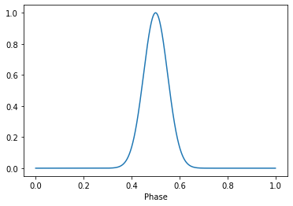
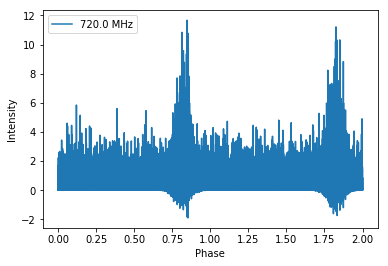
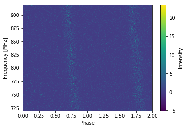

.. note:: This tutorial was generated from a Jupyter notebook that can be
          downloaded `here <_static/notebooks/tutorial_1.ipynb>`_.

.. _tutorial_1:

Getting Started: Introductory Tutorial 1
========================================

This notebook introduces the basic features of the pulsar signal
simulator, and leading the user through the steps of how to simulate a
pulsar signal from start to finish.

The ``PsrSigSim`` can be run in a jupyter notebook or python script.

.. code:: python

    # import some useful packages
    import numpy as np
    import matplotlib.pyplot as plt
    %matplotlib inline
    
    # import the pulsar signal simulator
    import psrsigsim as pss

The Signal
----------

The first thing we need to do in order to simulate a pulsar is to
initialize our signal. This will be done for a filterbank-style signal
class. This type of signal needs parameters first though. One needs to
enter the number of frequency channels the signal should be recorded
with, what the bandwidth of the signal is, what the center frequency of
the signal is, and how quickly it should record the data, or the
sampling rate. To make single pulses, we also need to set the ‘fold’
flag to False (the default is True).

For this example, we will simulate single pulses from a 350 MHz
observation from the Green Bank Telescope.

.. code:: python

    # Define our signal variables.
    f0 = 820 # center observing frequecy in MHz
    bw = 200.0 # observation MHz
    Nf = 128 # number of frequency channels
    f_samp = 0.001526 # sample rate of data in MHz (here 0.6554 ms for size purposes)
    # Now we define our signal
    signal_1 = pss.signal.FilterBankSignal(fcent = f0, bandwidth = bw, Nsubband=Nf, fold = False)

The Pulsar
----------

Next we define a pulsar object. The pulsar needs a pulse shape though.
There are a number of ways to define this in the pulsar signal
simulator, but here we will make a simple, predefined Gaussian profile.
The Guassian needs three parameters, an amplitude, a width (or sigma),
and a peak, the center of the Gaussian in phase space (e.g. 0-1).

.. code:: python

    # We define the Guassian profile
    gauss_prof = pss.pulsar.GaussProfile(peak = 0.5, width = 0.05, amp = 1.0)

Defining the profile just tells the simulator how to make the pulses. If
we want to see what they look like, we need to initialize the profile,
and then we can give it a number of phase bins and plot it.

.. code:: python

    # We want to use 2048 phase bins and just one frequency channel for this test.
    gauss_prof.init_profiles(2048, Nchan = 1)

.. code:: python

    # We can look at the shape of the profile array to make sure it matches with what we expect
    print(np.shape(gauss_prof.profiles))

.. parsed-literal::

    (1, 2048)

.. code:: python

    # And then we can plot the array to see what the profile looks like
    plt.plot(np.linspace(0,1,2048), gauss_prof.profiles[0])
    plt.xlabel("Phase")
    plt.show()
    plt.close()

Now we can define the pulsar object itself. Out pulsar needs a period
(s), a mean flux (Jy), a profile, which we’ve defined above, and a name
(e.g. JXXXX+XXXX).

.. code:: python

    # Define the values needed for the puslar
    period = 1.0 # pulse period of our simulated pulsar, here one second
    Smean = 10.0 # The mean flux of the pulsar, here 10.0 Jy (note that this is very bright for a pulsar)
    psr_name = "J0000+0000" # The name of our simulated pulsar
    # Now we define the pulsar
    pulsar_1 = pss.pulsar.Pulsar(period, Smean, profiles=gauss_prof, name = psr_name)

The ISM
-------

Now we define the interstellar medium (ISM) properties that will affect
our pulsar signal as it ‘travels’ from the pulsar to our telescope. The
main property here is the dispersion measure, DM, which is the number of
electrons along the line of sight from us to the pulsar. These electrons
will delay the pulsed emission from the pulsar, causing lower radio
frequencies to arrive at the telescope later than higher radio
frequencies. Here we will just define the ISM object and the DM we would
like the pulsar to have.

.. code:: python

    # Define the dispersion measure
    dm = 40.0 # pc cm^-3
    # And define the ISM object, note that this class takes no initial arguements
    ism_1 = pss.ism.ISM()

The Telescope
-------------

The last thing we need to define is the telescope object. While you can
define a telescope with any properties that you like with the pulsar
signal simulator, it also comes with two pre-defined telescopes: The
Arecibo Telescope and the Green Bank Telescope 9GBT). We will set up the
GBT as our telescope. The telescope class when set up from a predefined
telescope needs no additional input.

.. code:: python

    tscope = pss.telescope.telescope.GBT()

Simulating the Signal
---------------------

Now we have everything set up to actually simulate our signal, though
there is one extra value we need to define: the simulated observation
length (s). For size and time purposes, we will only simulate 2 seconds
of observing, which amounts to just two pulse periods.

.. code:: python

    # define the observation length
    obslen = 2.0 # seconds

Now we can make the pulses! This is done using the make_pulses()
function of the ``pulsar`` object we made before. It takes just the
signal object, and the observation length.

.. code:: python

    pulsar_1.make_pulses(signal_1, tobs = obslen)

Next we disperse our pulses, or propagate them through the interstellar
medium. We can do that easily using the disperse() function of the ISM
object. This again takes the signal object, as well as the DM value
defined above.

.. code:: python

    ism_1.disperse(signal_1, dm)

.. parsed-literal::

    98% dispersed in 1.399 seconds.

Now we need to observe the signal with our telescope. This will add
radiometer noise from the telescope receiver and backend to the signal.
This is done using the observe() function of the telescope object, which
takes the signal, the pulsar, the system name (for the GBT telescope
this is either ‘820_GUPPI’ or ‘Lband_GUPPI’), and make sure that the
noise variable is set to ‘True’.

.. code:: python

    tscope.observe(signal_1, pulsar_1, system="820_GUPPI", noise=True)

.. parsed-literal::

    WARNING: AstropyDeprecationWarning: The truth value of a Quantity is ambiguous. In the future this will raise a ValueError. [astropy.units.quantity]

Looking at the Results
~~~~~~~~~~~~~~~~~~~~~~

And that’s all that needs to be done to simulate a signal! If you want
to view the simulated signal, you can access the full data array through
``signal_1.data``. Two ways to look at the data are to just plot an
individual frequency channel (a phase plot), or make a 2-D of the power
as a function of the pulse phase and frequency channel (a filterbank
plot), both of which are demonstrated below.

.. code:: python

    # Get the phases of the pulse
    phases = np.linspace(0, obslen/period, len(signal_1.data[0,:]))
    # Plot just the pulses in the first frequency channels
    plt.plot(phases, signal_1.data[0,:], label = signal_1.dat_freq[0])
    plt.ylabel("Intensity")
    plt.xlabel("Phase")
    plt.legend(loc = 'best')
    plt.show()
    plt.close()

.. code:: python

    # Make the 2-D plot of intensity v. frequency and pulse phase. You can see the slight dispersive sweep here.
    plt.imshow(signal_1.data, aspect = 'auto', interpolation='nearest', origin = 'lower', \
               extent = [min(phases), max(phases), signal_1.dat_freq[0].value, signal_1.dat_freq[-1].value])
    plt.ylabel("Frequency [MHz]")
    plt.xlabel("Phase")
    plt.colorbar(label = "Intensity")
    plt.show()
    plt.close()

