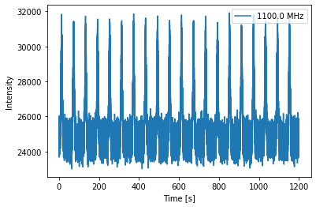
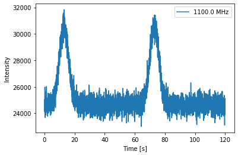
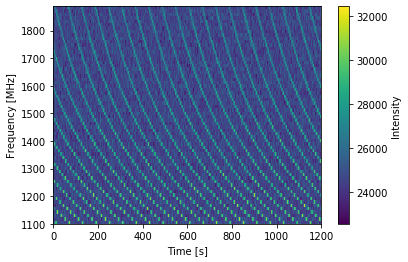
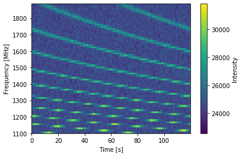

.. note:: This tutorial was generated from a Jupyter notebook that can be
          downloaded `here <_static/notebooks/tutorial_2.ipynb>`_.

.. _tutorial_2:

Fold Mode: Introductory Tutorial 2
==================================

This notebook will build on the first tutorial, showing more features of
the PsrSigSim. Details will be given for new features, while other
features have been discussed in the previous tutorial notebook. This
notebook shows the details of using the fold-mode, or simulation of
subintegrated data. This may be useful for simulating pulsar timing
style data, as a way to save disk space and computation time. For Pulsar
Timing Arrays, and most long-term monitoring of millisecond pulsars,
this is the preferred mode.

The example we use here is for simulating precision pulsar timing data.
Instead of simulating the single pulses from a pulsar and then folding
them to obtain a high signal-to-noise pulse profiles to use for
precision pulsar timing, we can simulate a pre-folded observation.

.. code:: python

    # import some useful packages
    import numpy as np
    import matplotlib.pyplot as plt
    %matplotlib inline

    # import the pulsar signal simulator
    import psrsigsim as pss

.. parsed-literal::

    WARNING: Using astropy version 3.2.3. To get most recent IERS data, upgrade to astropy >= 4.0 [pint]
    WARNING: Using astropy version 3.2.3. To get most recent IERS data, upgrade to astropy >= 4.0 [pint.erfautils]

Setting up the Folded Signal
----------------------------

Here we will again set up the signal class, but this time we will add
some additional flags, namely the ``fold``, ``sample_rate``, and
``sublen`` flags. Setting ``fold=True`` tells the simulator that we want
to simulate folded data, with subinegration lengths of ``sublen=X``
where ``X`` is some number of seconds. We will set the sample rate such
that we will simulate 2048 samples across the pulse period. A pulse
period of 10 ms is used for this simulation.

We will simulate a 20 minute long observation total, with
subintegrations of 1 minute. The other simulation parameters will be 64
frequency channels each 12.5 MHz wide (for 800 MHz bandwidth) observed
with the Green Bank Telescope at L-band (1500 MHz center frequency).

.. code:: python

    # Define our signal variables.
    f0 = 1500 # center observing frequecy in MHz
    bw = 800.0 # observation MHz
    Nf = 64 # number of frequency channels
    # We define the pulse period early here so we can similarly define the frequency
    period = 0.010 # pulsar period in seconds
    f_samp = (1.0/period)*2048*10**-6 # sample rate of data in MHz (here 2048 samples across the pulse period
    sublen = 60.0 # subintegration length in seconds, or rate to dump data at
    # Now we define our signal
    signal_fold = pss.signal.FilterBankSignal(fcent = f0, bandwidth = bw, Nsubband=Nf, sample_rate = f_samp,
                                           sublen = sublen, fold = True) # fold is set to `True`

.. parsed-literal::

    Warning: specified sample rate 0.20479999999999998 MHz < Nyquist frequency 1600.0 MHz

Profile, ISM and Telescope
--------------------------

Here we set up a ``Profile``, ``ISM`` and ``telescope`` objects in the
same way as in the previous tutorial. We will again use a basic Gaussian
profile.

.. code:: python

    # We define the Guassian profile
    gauss_prof = pss.pulsar.GaussProfile(peak = 0.5, width = 0.05, amp = 1.0)

    # Define the dispersion measure
    dm = 40.0 # pc cm^-3
    # And define the ISM object, note that this class takes no initial arguements
    ism_fold = pss.ism.ISM()

    tscope = pss.telescope.telescope.GBT()

Pulsar
------

Here we set up the ``Pulsar`` object. This is identical to the way we
set it up in the previous tutorial, but we show how to add a spectral
index to the ``Pulsar``. This is done by setting the ``specidx`` value
and the reference frequency, or ``ref_freq`` variable in the ``Pulsar``
definition. The reference frequency is the radio frequency that te
``Smean`` is referenced to, here 1400 MHz. If no spectral index is
desired, the default ``specidx`` value is 0 (no spectal index), and the
default value of ``ref_freq`` is the center frequency, ``f0``, defined
in our ``Signal`` above. We also use a more realisitic mean flux of 5
mJy (or 0.005 Jy).

.. code:: python

    # Define the values needed for the puslar
    Smean = 0.005 # The mean flux of the pulsar, here 0.005 Jy
    psr_name = "J0000+0000" # The name of our simulated pulsar
    specidx = -1.6 # The spectral index of the simulated pulsar
    ref_freq = 1400.0 # The radio frequency at which Smean of the simulated signal is equal to the input value, in MHz
    # Now we define the pulsar
    pulsar_fold = pss.pulsar.Pulsar(period, Smean, profiles=gauss_prof, name = psr_name,
                                    specidx = specidx, ref_freq = ref_freq)

Simulating the Signal
---------------------

Now we will simulate the signal. Here the commands are the same as
before, we just need to define an observation length (20 minutes), make
the pulses with the pulsar, disperse the data, and then observe the
pulsar with our telescope. For the telescope, we will use the
``Lband_GUPPI`` system predefined by in the GBT telescope class.

.. code:: python

    # define the observation length
    obslen = 60.0*20 # seconds, 20 minutes in total

.. code:: python

    # Make the pulses
    pulsar_fold.make_pulses(signal_fold, tobs = obslen)

.. code:: python

    # Disperse the data
    ism_fold.disperse(signal_fold, dm)

.. parsed-literal::

    98% dispersed in 0.140 seconds.

.. code:: python

    # Observe with the telescope
    tscope.observe(signal_fold, pulsar_fold, system="Lband_GUPPI", noise=True)

Visualizing the Data
--------------------

Now that we’ve simuluated the signal, we can take a look at the
subintegrated data that we have produced. We can access it the same way
as described in the previous tutorial.

.. code:: python

    # Get the phases of the pulse
    time = np.linspace(0, obslen, len(signal_fold.data[0,:]))
    # Plot just the pulses in the first frequency channels
    plt.plot(time, signal_fold.data[0,:], label = signal_fold.dat_freq[0])
    plt.ylabel("Intensity")
    plt.xlabel("Time [s]")
    plt.legend(loc = 'best')
    plt.show()
    plt.close()

If we zoom in on just the first two pulse periods…

.. code:: python

    # Since we know there are 2048 bins per pulse period, we can index the appropriate amount
    plt.plot(time[:4096], signal_fold.data[0,:4096], label = signal_fold.dat_freq[0])
    plt.ylabel("Intensity")
    plt.xlabel("Time [s]")
    plt.legend(loc = 'best')
    plt.show()
    plt.close()

We can clearly see the pulse profile above the noise level now. By
making subintegrated data, we build up the signal of the simulated
pulses to be easily visible. With a 10 ms period and 1 minute
subintegrations, each of these pulses acts as if we have folded (1
minutes / 10 ms) = 6000 pulses together. We can look at the 2D
spectrogram of these pulses as well.

.. code:: python

    # Make the 2-D plot of intensity v. frequency and pulse phase. You can see the slight dispersive sweep here.
    plt.imshow(signal_fold.data, aspect = 'auto', interpolation='nearest', origin = 'lower', \
               extent = [min(time), max(time), signal_fold.dat_freq[0].value, signal_fold.dat_freq[-1].value])
    plt.ylabel("Frequency [MHz]")
    plt.xlabel("Time [s]")
    plt.colorbar(label = "Intensity")
    plt.show()
    plt.close()

The pulse and dispersive sweep is clearly visible with the high
signal-to-noise ratio. We can see that the pulse is brighter at lower
radio frequencies as well, which is the effect of our spectral index.
Again, zooming in on the first two subintegrations…

.. code:: python

    plt.imshow(signal_fold.data[:,:4096], aspect = 'auto', interpolation='nearest', origin = 'lower', \
               extent = [min(time[:4096]), max(time[:4096]), signal_fold.dat_freq[0].value, signal_fold.dat_freq[-1].value])
    plt.ylabel("Frequency [MHz]")
    plt.xlabel("Time [s]")
    plt.colorbar(label = "Intensity")
    plt.show()
    plt.close()

Here the dispersion clearly shows that the pulses are dispersed for over
two minutes across the observing bandwidth.

Note about randomly generated pulses and noise
~~~~~~~~~~~~~~~~~~~~~~~~~~~~~~~~~~~~~~~~~~~~~~

``PsrSigSim`` uses ``numpy.random`` under the hood in order to generate
the radio pulses and various types of noise. If a user desires or
requires that this randomly generated data is reproducible we recommend
using a call the seed generator native to ``Numpy`` before calling the
function that produces the random noise/pulses. Newer versions of
``Numpy`` are moving toward slightly different
`functionality/syntax <https://numpy.org/doc/stable/reference/random/index.html>`__,
but is essentially used in the same way.

::

   numpy.random.seed(1776)
   pulsar_1.make_pulses(signal_1, tobs=obslen)
